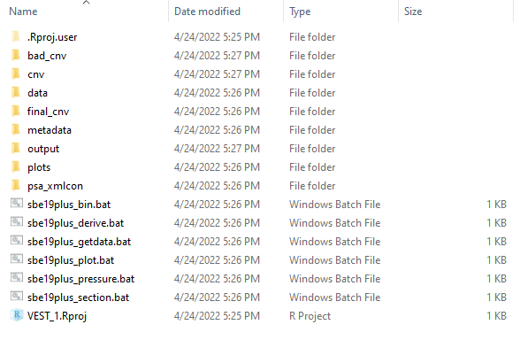
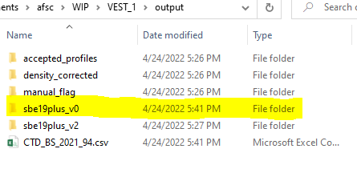
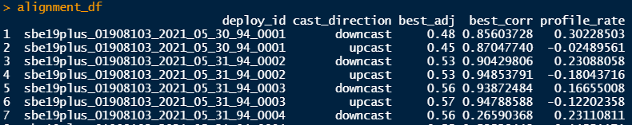
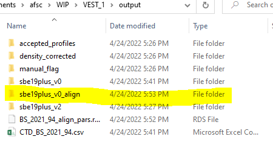
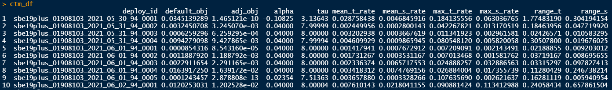
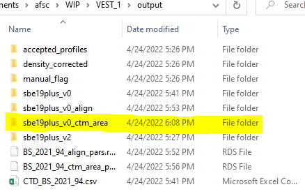
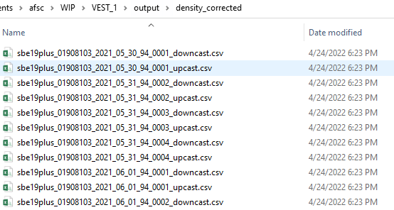
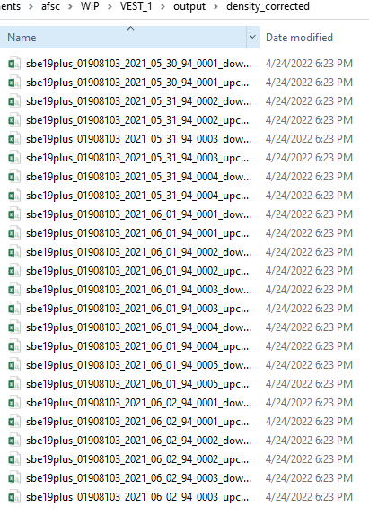

# Process GAP's CTD data using gapctd

*WARNING: Knitting the .Rmd version of this document will not process any data. To process data, set eval=TRUE or run code blocks one at a time.*

## Introduction

This document demonstrates how to use the gapctd package to process CTD data collected on Alaska Fisheries Science Center bottom trawl surveys and generate data products. This process was developed for use with SBE19plus V2 CTDs with induction pumps that are deployed on bottom-trawl survey gear in the eastern Bering Sea, Gulf of Alaska, and Aleutian Islands. Using the package requires a connection to the AFSC RACEBASE and RACE_DATA.

## 1. Installation

Install SBE Data Processing software (available from th manufacturer) and the gapctd package.

```{r install, include=TRUE, eval=FALSE}
devtools::install_github("afsc-gap-products/gapctd")
```


## 2. Load package, define global variables, and connect to Oracle

Load the `gapctd` package. Assign vessel, year, and region (BS, GOA, or AI) variables and establish a connection to Oracle using the RODBC package. Set the source directory where the CTD hex files and .xmlcon file are stored.

```{r setup, include=TRUE, eval=FALSE}
library(gapctd)

# Select vessel, year, and region
vessel <- 94
year <- 2021
region <- "BS"
ctd_dir <- "G:/RACE_CTD/data/2021/ebs/v94_ctd1"
try_method <- "sbe19plus_v0"

# Establish Oracle connection connection
channel <- gapctd::get_connected(schema = "AFSC")
```

## 3. Run batch processing using SeaBird's typical methods

The `run_method` function is a wrapper function that sets up the working directory for data processing then runs all of the [batch processing steps](./doc/batch_processing_methods.md) for the chosen processing method. This function will be run four times during processing with different inputs to (1) set up the local directory and batch process using 'typical' settings for the SBE19plus V2, (2) run batch processing without Alignment or Cell Thermal Mass Correction modules, (3) run batch processing with estimated alignment parameters, (4) run batch processing with estimated alignment and cell thermal mass correction parameters.

The `run_method` function runs a sequence of batch processing modules on cast data depending on whether `alignment_df` or `ctm_df` are passed to the function (in Steps 6 and 8). 

In this first run, batch processing modules are run with 'typical' settings for alignment and cell thermal mass. SBE data processing will open and close automatically several times.

_Note: SBE Batch Processing software may have errors during batch processing. These errors should generally be ignored because they are generally due to missing data from upcasts or downcasts (due to unplanned shutdown), or files where the CTD was quickly turned on and off quickly while on deck. See [SBE Data Processing Errors](./doc/SBE_data_processing_errors.md) for instructions to skip over errors._

```{r run_default_method, include=TRUE, eval=FALSE}
# Move files from storage to local directory
gapctd::run_method(vessel = vessel,
                   year = year,
                   region = region,
                   channel = channel,
                   processing_method = "sbe19plus_v2",
                   storage_directory = here::here("output", "sbe19plus_v2"),
                   ctd_dir = ctd_dir)
```
<br><br>
If run_method runs successfully in the working directory for the first time, the following subdirectories will be created in the working directory:
<ul>
<li><b>/bad_cnv/</b>: Contains .cnv files that didn't have data or matching hauls. ([example](./doc/assets/batch_screenshots/batch_2.png))</li>
<li><b>/cnv/</b>: Processed .cnv files generated by batch processing. If batch processing ran correctly, there will be files with the suffix binavg.cnv for every successful cast. ([example](./doc/assets/batch_screenshots/batch_3.png))</li> 
<li><b>/data/</b>: Raw data files (.hex) copied from the directory provided to `run_method(ctd_dir = {directory})` and haul data for the vessel/cruise as a .rds file.  ([example](./doc/assets/batch_screenshots/batch_4.png))</li>
<li><b>/metadata/</b>: Contains a .csv file listing all of the deployment ID files and corresponding hauls from the survey. Includes average bottom temperature and salinity.  ([example](./doc/assets/batch_screenshots/batch_5.png))</li>
<li><b>final_cnv/</b>:  At this point, the directory should be empty, but it will eventually contain .cnv files that have gone through all automatic data processing steps.</li>
<li><b>/output/</b>: Contains four subdirectories, one of which should be an `/sbe19plus_v2/` that contains .cnv files ending in binavg.cnv, downcast.cnv, and upcast.cnv. The other three subdirectories (accepted_profiles, density_corrected, manual_flag) are empty.</li> ([example](./doc/assets/batch_screenshots/batch_1.png))</li>
<li><b>/psa_xmlcon/</b>: Config file for the CTD unit (.xmlcon) and SBE processing files for data processing modules (.psa). ([example](./doc/assets/batch_screenshots/batch_6.png))</li>
<li><b>/plots/</b>: Empty directory.</li>
<li><b>.bat files</b>: Nine batch files (.bat) in the working directory. These are used to run SBE data processing modules using system input from R.</li>
</ul>




The cnv files from this method are copied to an output directory that is named for method ./output/sbe19plus_v2.


## 4. Run batch processing without Alignment or Cell-Thermal Mass (CTM) Correction modules

Next, run batch processing without alignment or cell thermal mass correction modules. Outputs from this batch processing routine will be used to estimate alignment (offset) parameters for the temperature channel to align temperature and conductivity channels.


```{r run_without_align_ctm, include=TRUE, eval=FALSE}
gapctd::run_method(vessel = vessel,
                   year = year,
                   region = region,
                   channel = channel,
                   processing_method = try_method,
                   storage_directory = here::here("output", try_method),
                   ctd_dir = ctd_dir)
```

The cnv files from batch processing are copied to an output directory that is named for method ./output/sbe19plus_v2. The function also creates a metadata .csv file that contains means of bottom variables for each deployment in the directory ./output/metadata.




## 5. Estimate alignment parameters

The physical misalignment of sensors and lagged responses can cause errors in salinity that are especially pronounced near density interfaces. The default SBE Data Processing modules handle this issue using a temperature alignment adjustment of +0.5 seconds to account for the lagged response of the thermistor relative to pressure. However, this default alignment setting is not ideal for all profiles, so the gapctd pacakge estimates an optimal alignment for temperature (see [Optimizing Temperature Alignment](./doc/estimating_alignment.html) for an example).

The `run_alignment_calcs` function optimizes the temperature alignment parameter by finding the alignment value that maximizes the correlation between rates of change in temperature and rates of change in conductivity (i.e. first derivative of temperature and conductivity with respect to pressure). The rationale for this approach is that changes in temperature and salinity are generally expected to occur simultaneously around density interfaces in a stratified water column. For each upcast and downcast, the function time shifts temperature relative to pressure by -1.25 to +1.25 seconds (0.01 second increments) then calculates the correlation. The adjustment with the best correlation is used in subsequent steps to adjust the temperature module alignment.

In the case below, correlations are Spearman rank order correlations (`cor_method = "spearman"`) for pressure >= 4 db (min_pressure = 4). Although cor_method could be set to "pearson" or "spearman", "spearman" is preferred because some sampling errors results in large outliers that have an unreasonably strong influence on Pearson correlations.
 

```{r estimate_align, include=TRUE, eval=FALSE}
alignment_df <-
  gapctd::run_alignment_calcs(
    profile_files = sort(c(
      list.files(
        here::here("output", try_method),
        full.names = TRUE,
        pattern = "downcast.cnv"
      ),
      list.files(
        here::here("output", try_method),
        full.names = TRUE,
        pattern = "upcast.cnv"
      )
    )),
    make_diagnostic_plots = TRUE,
    min_pressure = 4,
    cor_method = "spearman",
  )

# Save alignment parameters to .rds
saveRDS(object = alignment_df, here::here("output", paste0(region, "_", year, "_", vessel, "_align_pars.rds")))
```



`run_alignment_calcs` returns a data.frame containing:

<ul>
<li><b>deploy_id</b>: The name of the original deployment file.</li>
<li><b>cast_direction</b>: Direction for which the adjustment parameter is calculated.</li>
<li><b>best_adj</b>: Optimized temperature alignment parameter for the Align module.</li>
<li><b>best_corr</b>: Correlation for the optimized alignment.</li>
<li><b>profile_rate</b>: Average profiling speed for the cast. In the example above, there were equipment malfunctions that led to little or no profile data being collected during upcasts, potentially due to low battery issues.</li>
</ul>

 from /output/alignment.pdf. The panel title shows the deployment ID and cast direction (top line) and optimal time adjustment (second line).")

## 6. Run batch processing with estimated alignment parameters

To run batch processing with the estimated alignment parameters, pass the output of `run_alignment_calcs` from step 5 to `run_method`. The output is saved to ./output/sbe19plus_v0_align and alignment parameters are read from the .rds file generated in step 5.


```{r apply_align, include=TRUE, eval=FALSE}
gapctd::run_method(vessel = vessel,
                   year = year,
                   region = region,
                   channel = channel,
                   processing_method = try_method,
                   storage_directory = here::here("output", paste0(try_method, "_align")),
                   ctd_dir = ctd_dir,
                   alignment_df = readRDS(file = here::here("output", paste0(region, "_", year, "_", vessel, "_align_pars.rds"))))
```



## 7. Estimate CTM Correction parameters

The thermistor and conductivity cell are constructed with materials that have different thermal inertia and, as such, they heat and cool at different rates. These differences in heating/cooling rates are problem when calculating salinity from conductivity and temperature measurements. The Cell Thermal Mass Correction module in SBE Data Processing can be used to correct these effects, but optimal parameters for the correction depend on the magnitude of the error in conductivity measurements.

The `run_ctm_adjust_tsarea` function estimates optimal cell thermal mass correction parameters for hauls by minimizing the area between temperature-salinity curves from upcasts and downcasts, following [Garau et al. (2011)](https://doi.org/10.1175/JTECH-D-10-05030.1). If data are missing from an upcast or downcast, parameters that minimize the path distance of salinity curves is used instead of area.

In the case below, the starting parameters for the optimization are `alpha = 0.04` and `tau = 8`, which are the manufacturer's 'typical' values for the SBE19plus. The Broyden-Fletcher-Goldfarb-Shannon algorithm (`optim_method = "BFGS"`) is used for numerical optimization, with a maximum of 500 optimization steps. If the algorithm doesn't converge or the function estimates implausible parameter values, the default parameters are used.

```{r estimate_ctm, include=TRUE, eval=FALSE}
ctm_df <- gapctd::run_ctm_adjust_tsarea(profile_files = sort(c(list.files(here::here("output", "sbe19plus_v0_align"),
                                                                                 full.names = TRUE, pattern = "downcast.cnv"),
                                                                      list.files(here::here("output", "sbe19plus_v0_align"),
                                                                                 full.names = TRUE, pattern = "upcast.cnv"))),
                                               min_pressure = 4,
                                               optim_method = "BFGS",  #"SANN",
                                               optim_maxit = 500,
                                               start_alpha = 0.04,
                                               start_tau = 8)

# Save CTM correction parameters to .rds
saveRDS(ctm_df, file = here::here("output", paste0(region, "_", year, "_", vessel, "_ctm_area_pars.rds")))
```



<ul>
<li><b>deploy_id</b>: The name of the original deployment file.</li>
<li><b>default_obj</b>: Value of the objective function (usually area between temperature-salinity curves) using the typical parameters, `alpha = 0.04` and `tau = 8`.</li>
<li><b>adj_obj</b>: Value of the objective function after optimization.</li>
<li><b>alpha</b>: Estimated value of &alpha; after optimization.</li>
<li><b>tau</b>:  Estimated value of &tau;<sub>CTM</sub> after optimization.</li>
<li><b>mean_t_rate</b>: Mean absolute rate of change in temperature (&deg;C/db) during upcasts and downcasts.</li>
<li><b>mean_s_rate</b>:  Mean absolute rate of change in salinity (PSU/db) per pressure during upcasts and downcasts.</li>
<li><b>max_t_rate</b>: Maximum absolute rate of change in temperature (&deg;C/db) during upcasts and downcasts.</li>
<li><b>max_s_rate</b>: Maximum absolute rate of change in salinity (PSU/db) during upcasts and downcasts. </li>
<li><b>range_t</b>: Total range of temperature during the deployment.</li>
<li><b>range_s</b>: Total range of salinity during the deployment.</li>
</ul>

## 8. Run batch processing with estimated alignment and cell thermal mass correction parameters

Run batch processing with estimated cell thermal mass correction parameters on data that have already been temperature aligned.

```{r apply_ctm, include=TRUE, eval=FALSE}
gapctd::run_method(vessel = vessel,
                   year = year,
                   region = region,
                   channel = channel,
                   processing_method = try_method,
                   storage_directory = here::here("output", paste0(try_method, "_ctm_area")),
                   ctd_dir = ctd_dir,
                   ctm_df = readRDS(file = here::here("output", paste0(region, "_", year, "_", vessel, "_ctm_area_pars.rds"))))
```



## 9. Compare batch procesing outputs

By following the processing steps above, there will be four sets of upcast and downcast profiles for the four different batch processing runs. The `compare_methods` function calculates the area between temperature-salinity curves for each of the casts to select the 'best' method for each cast. Area calculations are based on the same method as the `run_ctm_adjust_tsarea` function and path distance for salinity is used instead of area if data only exist for a downcast or upcast.

In the example below, areas are calculated from binned data (pattern_downcast = "downcast_binavg.cnv", pattern_upcast = "upcast_binavg.cnv") instead of raw data due to the influence of large outliers on area calculations. The minimum pressure for area calculations is 4 db (min_pressure_bin = 4). Plots of pressure versus temperature and pressure versus salinity from each haul will be saved to plots/binavg/align_ctd_method.

```{r compare_methods, include=TRUE, eval=FALSE}
compare_df <- gapctd::compare_methods(prefix = "/binavg/align_ctd_method",
                                      method_labels = c("Estimated (Raw)", "Estimated (Aligned)", "Estimated (CTM-Area)", "Typical method"),
                                      processing_method = c("sbe19plus_v0", "sbe19plus_v0_align", "sbe19plus_v0_ctm_area", "sbe19plus_v2"),
                                      return_output = TRUE,
                                      min_pressure_bin = 4,
                                      pattern_downcast = "downcast_binavg.cnv",
                                      pattern_upcast = "upcast_binavg.cnv")
```


. 'Estimated (Raw)' shows results without using alignment or cell thermal mass correction parameters (processing_method = sbe19plus_v0 from step 4); 'Estimated (Aligned)' shows results after aligning using estimated alignment (Step 6); 'Estimated (CTM Area)' shows results after using estimated alignment parameters and cell thermal mass correction parameters (Step 8). The panel with the thick line denotes the 'best' method based on the area between T-S curves. Please note that this figure is from a different vessel/cruise than the example.")

The output of `compare_methods` is a list containing two data.frames, compare_df and best_df. compare_df contains the raw data that are shown in the plot. best_df contains:

<ul>
<li><b>deploy</b>: The name of the original deployment file.</li>
<li><b>direction</b>: Cast direction</li>
<li><b>method</b>: The best method for the deployment based on the area between temperature-salinity curves or, if only an upcast or downcast is available, salinity path distance.</li>
<li><b>label</b>: Method label, corresponding with what's shown on the plot.</li>
<li><b>method_index</b>: Index for the method (can be used to reconstruct area calculations).</li>
<li><b>index</b>: Index for the deployment (can be used to reconstruct area calculations).</li>
<li><b>move</b>: The file corresponding with the best profile, which should be moved to final_cnv.</li>
</ul>


## 10. Save profiles from best methods for additional processing

The `move_to_final_cnv` function copies the best cnv files based on compare_methods to the final_cnv directory. Input is the best_df data.frame that was produced by compare_methods. 


```{r move_final_cnv, include=TRUE, eval=FALSE}
gapctd::move_to_final_cnv(best_df = compare_df$best_df)
```


## 11. Run density inversion check and correction

Some errors remain in the data after batch processing with SBE Data Processing modules. Examples of these errors include surface errors due to the inclusion of scans from before CTD measurements reached equilibrium surface temperature and salinity conditions, artifacts that are likely caused by shed wakes and flow reversal, and errant spikes in salinity deeper in the water column. These errors result in unrealistic density gradients in profiles, which can sometimes be detected and corrected based on density checks or the centered square of the Brunt-Vaisala buoyancy frequency, N^2.

The `correct_density_inversion` function flags and removes density inversion errors then estimates new values for temperature, conductivity, salinity, etc. based on interpolation. In the example below, a buoyancy frequency (`threshold_method = "bv"`) threshold is is used to remove and interpolate values whre N^2 < -1e-5 (threshold = -1e-5), following [McTaggart et al. (2010)](https://www.go-ship.org/Manual/McTaggart_et_al_CTD.pdf).

```{r density_inversion, include=TRUE, eval=FALSE}
gapctd::correct_density_inversion(threshold = -1e-5, 
                                  threshold_method = "bv", 
                                  correct_inversion = TRUE, 
                                  cnv_dir = here::here("final_cnv"), # Update to final_cnv
                                  pattern = "binavg")
```



## 12. Manually flag 'bad' data and interpolate 

After all of the automated data processing steps are complete, there will still be occasional errors in casts that need to be flagged manually. The `manual_flag_interpolate` function uses base R's graphical user interface for manual review and interpolation of profile data. Users can stop manual_flag_interpolate at any time and later restart where they left off. The function only reviews profiles that aren't in ./output/manual_flag.

*NOTE: Please refer to the [manual flag documentation](./doc/manual_flag_interpolate.md) for instructions on how to use the `manual_flag_interpolate` function.*

```{r manual_flag, include=TRUE, eval=FALSE}
gapctd::manual_flag_interpolate()
```




## 13. Review

The `manual_review` function is used to visually inspect 'final' profiles to verify that they are sufficient for use in a data product. Profiles that pass quality control steps are moved to the directory ./output/accepted_profiles. Profiles that do not pass quality control steps are removed from the directory ./output/manual_flag and can either be reviewed again using the manual_flag step or excluded from the final data product.

```{r manual_review, include=TRUE, eval=FALSE}
gapctd::manual_review()
```

.")

To accept a profile, type 'y' in the console and press Enter. To reject a profile, type 'n' and press Enter. Rejected profiles can be re-examined using `manual_flag_interpolate` or re-processed using remedial methods. Profiles that ultimately do not pass this last round of visual inspection will not be included in the final data product.


## 14. Packaging the data product

In development

## References

Garau, B., S. Ruiz, W. G. Zhang, A. Pascual, E. Heslop, J. Kerfoot, and J. Tintoré, 2011: Thermal lag correction on slocum CTD glider data. J. Atmos. Ocean. Technol., 28, 1065–1071, [https://doi.org/10.1175/JTECH-D-10-05030.1](https://doi.org/10.1175/JTECH-D-10-05030.1)

McTaggart, K.E., G.C. Johnson, M.C. Johnson, F.M. Delahoyde, J.H. Swift. 2010. Notes on CTD/O<sub>2</sub> data acquisition and processing using Sea-Bird hardware and software (as available). <b><i>In</b></i> The GO-SHIP Repeat Hydrography Manual: A Collection of Expert Reports and Guidelines. IOCCP Report No. 14, ICPO Publication Series No. 134, Version 1, 2010. [https://www.go-ship.org/Manual/McTaggart_et_al_CTD.pdf](https://www.go-ship.org/Manual/McTaggart_et_al_CTD.pdf)