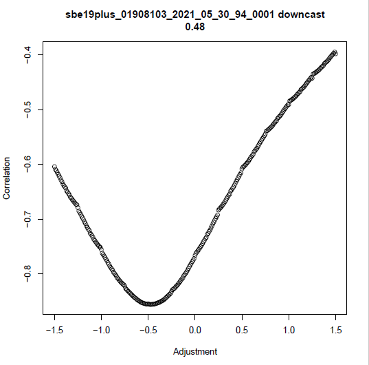

# Process GAP's CTD data using gapctd

*WARNING: Knitting the .Rmd version of this document will not process any data. To process data using the code below, use [this script](./processing_files/2021/2021_VEST_8103.R).*

## Introduction

The gapctd package processes CTD data collected on Alaska Fisheries Science Center bottom trawl surveys and generates data products. The entire data processing workflow is run in R using R functions aside from the data decoding step, which requires SBE Data Processing Software. The package uses methods from the oce package, R implementations of SBE Data Processing Modules, and optimization methods from the underway CTD and glider literature. Processing requires a connection to the AFSC RACEBASE and RACE_DATA. Data processing methods were developed and optimized for Sea-Bird SBE19plus V2 CTDs with induction pumps that are deployed on bottom-trawl survey gear in the eastern Bering Sea, Gulf of Alaska, and Aleutian Islands.

## 1. Installation

Install SBE Data Processing software (available from the manufacturer) and the gapctd package.

```{r install, include=TRUE, eval=FALSE}
devtools::install_github("afsc-gap-products/gapctd")
```


## 2. Load package, define global variables, and connect to Oracle

Load the `gapctd` package. Assign vessel, cruise, and region (BS, GOA, or AI) variables and set the source directory where CTD hex files and .xmlcon file are stored.

```{r setup, include=TRUE, eval=FALSE}
library(gapctd)

# Select vessel, cruise, and region
vessel <- 94
cruise <- c(202101, 202202)
region <- "BS"
ctd_dir <- "G:/RACE_CTD/data/2021/ebs/v94_ctd1" # Directory w/ CTD data (.hex) and config (.xmlcon)
processing_method <- "gapctd"
```

## 3. Setup directory for processing

The `setup_gapctd_directory` function sets up the working directory for processing data from a single CTD, vessel, and cruise. Raw CTD data files (.hex) and configuration files (.xmlcon) are copied from the source directory, ctd_dir, to the /data/ and /psa_xmlcon/ directories. Then, the SBE Data Processing DatCnv module is run using system commands to convert .hex files to human-readable decoded CTD data files (.cnv) that get saved in the /cnv/ directory.

*Note: A new directory/project will need to setup for each cruise/vessel/CTD combination.*

```{r setup_directory, include = TRUE, eval = FALSE}
# Setup directory
gapctd:::setup_gapctd_directory(processing_method = processing_method, 
                                ctd_dir = ctd_dir)

```

## 4. Retrieve haul data from RACEBASE

The `get_haul_data` function retrieves haul data for a vessel/cruise from RACEBASE and writes the haul data to an R data file ( /output/HAUL_DATA_[vessel]_[cruise].rds).

```{r get_haul_data, include = TRUE, eval = FALSE}
# Establish Oracle connection connection
channel <- gapctd::get_connected(schema = "AFSC")

# Get haul data from RACEBASE and write to an .rds file in /output/
haul_df <- gapctd:::get_haul_data(channel = channel,
                                  vessel = vessel,
                                  cruise = cruise,
                                  tzone = "America/Anchorage")

# Load haul data
haul_df <- readRDS(file = here::here("output", 
                                     paste0("HAUL_DATA_", vessel, "_", paste(cruise, collapse = "_"), ".rds")))
```

The tzone argument (tzone="America/Anchorage") specifies the timezone to use for haul event times in RACEBASE that are stored in UTC.

## 5. Run gapctd processing methods on CTD files

The `wrapper_run_gapctd` function implements the `run_gapctd` function on each CTD file in the working directory. The `run_gapctd` function processes data for a single CTD data file (.cnv) using the [processing steps](./doc/batch_processing_steps.md) we have found works best for our deployments across bottom trawl survey regions.

*Note: Running wrapper_run_gapctd the first time takes 10-18 hours for a full vessel/cruise.*

```{r wrapper_run_gapctd, include=TRUE, eval=FALSE}
# Run data processing algorithm on files. Write .rds
gapctd:::wrapper_run_gapctd(cnv_dir_path = here::here("cnv"), # Path to decoded CTD data (.cnv) files
                            processing_method = processing_method, # Processing method
                            haul_df = haul_df) # Haul data from step 4
```

Outputs from `wrapper_run_gapctd` are stored in oce objects that are saved in R data (.rds) files in /output/gapctd/ [(example)](./doc/example_cast_file.md). The files include three segments for each deployment (downcast, bottom, upcast). Haul metadata are included with each of the segments. If any segment is missing, it will not be included in the file (i.e., if the CTD shut-off during the deployment and there is no upcast data, there will not be an upcast file in the object).


## 6. Make metadata file

The `make_metadata_file` function reads in R data (.rds) files from each casts, calculates haul-level averages from bottom samples (i.e., mean bottom salinity, mean bottom temperature), and retrieves other metadata that are included in the data product. The data are then written to the file path specified using the output_path argument. This is the last time bottom data will be used in processing.


```{r make_metadata_file, include=TRUE, eval=FALSE}
# Make metadata and bottom averages file
gapctd:::make_metadata_file(rds_dir_path = here::here("output", "gapctd"),
                            in_pattern = "_raw.rds",
                            output_path = here::here("metadata", 
                                                     paste0("CTD_HAUL_DATA_", vessel, "_", paste(cruise, collapse = "_"), ".rds")))
```


## 7. Run data quality checks

The `move_bad_rds` function checks data files from each deployment for common errors in downcast and upcast profiles. Files with bad upcasts or downcasts are moved to /bad_cnv/ while good casts are retained in the /output/gapctd/ directory. If only one of the casts from a deployment fails data quality checks, the good profile is retained in the /output/gapctd directory.

```{r, move_bad_rds, include=TRUE, eval=FALSE}
# Move 'bad' files to bad_cnv
gapctd:::move_bad_rds(rds_dir_path = here::here("output", processing_method))
```

## 8. Visually inspect, flag, and interpolate bad data (first round)

*VERY IMPORTANT: If using R Studio, your display/GUI must be set to Actual Size! Use the drop down menu (View > Actual Size) to set your R Studio display to Actual Size*

There are often dynamic errors in profiles after the automated processing steps that typically appear as large salinity spikes. The `qc_flag_interpolate` function provides a graphical user interface that allows users to inspect plots of profile data for selected data and select erroneous data that should be removed and interpolated. The `wrapper_flag_interpolate` function is a wrapper for `qc_flag_interpolate`.

Please note that interpolation can sometimes behave in unintuitive ways when interpolating salinity and density because the function interpolates conductivity and temperature, not salinity and density. Salinity and density are recalculated after interpolating conductivity and temperature.

```{r flag_interpolate_1, include=TRUE, eval=FALSE}
# Visually inspect, flag, and interpolate
gapctd:::wrapper_flag_interpolate(rds_dir_path = here::here("output", processing_method),
                                  review = c("density", "salinity"))
```

You will review two sets of plots for every cast. Set #1 shows temperature, salinity, and density profiles. Set #2 shows the rate of change in salinity and salinity.

### 8.1 How to review plots

The goal of this step is to flag and remove large and sporadic errors. Small errors and errors that persist for multiple depth bins should not be removed.

Set 1: Pressure versus temperature (left), salinity (center), and density (right)
1. Review the right panel for density errors. 
2. Left click on any points in the right panel (density) that should be removed and interpolated. Do not select the points if there are errors in salinity that do not produce large errors in density.
3. Press Esc. If any points were selected, conductivity and temperature for the selected pressure bin will be removed and salinity and pressure will be recalculated.
4. Repeat 1-3 until there are no more errors to remove.

Set 2: Rate of change in salinity (left) and salinity (right)
1. Review the panels for salinity errors.
2. Left click on any points in the left panel (salinity) that should be removed and interpolated.
3. Press Esc. If any points were selected, conductivity and temperature for the selected pressure bin will be removed and salinity and pressure will be recalculated.
4. Repeat 1-3 until there are no more errors to remove.

## 9. Select profiles to include in data product (first round)

During this step, the user selects profiles that should be included in the data product. The `review_profiles` function provides an interface for visually inspecting profiles for each deployment and selecting the profiles that should be included in the final data product.

```{r review_profiles_1, include=TRUE, eval=FALSE}
# Review profiles
gapctd:::review_profiles(rds_dir_path = here::here("output", processing_method),
                         threshold = -1e-5, 
                         in_pattern = "_qc.rds")
```

Data from each deployment are displayed one at a time. If a downcast and upcast are both available, both will be shown simultaneously. If only one cast is available, only the downcast or upcast will be shown. The plots on the left panel show temperature (red) and salinity (green) versus depth. Plots on the right panel show density anomaly (blue) and buoyancy frequency (brown) versus depth. If there is a vertical line on the right panel, it shows the buoyancy frequency threshold below which the water column is considered unstable.

Follow instructions in the console to select profiles to use in the final data product: both casts (b), downcast (d), upcast (u), or none (0). If both casts are available from a deployment but none are selected, data from the cast will be reprocessed using a different approach to conductivity cell thermal mass correction and profiles will be reviewed again after processing.

The goal of this step is to select the profile(s) without remaining dynamic errors (e.g., unreasonable salinity spikes or density inversions).





## 10. Remedial corrections for conductivity cell thermal intertia errors

During this step, use the `remedial_ctm` to select deployments that should be reprocessed using the alternative method for conductivity cell thermal inertia error correction. Casts for each deployment are displayed sequentially. Use the console to select deployments that should be reprocessed (usually all casts).

In the alternative methods, conductivity cell thermal inertia parameters are estimated for individual casts by minimizing the path distance of the salinity curve instead of the primary method of estimating parameters for both casts by minimizing the area between upcast and downcast temperature-salinity curves.

```{r remedial_ctm, include=TRUE, eval=FALSE}
# Examine rejected profiles and run cell thermal mass corrections with alternate values using split_ctm()
gapctd:::remedial_ctm(rds_path = here::here("output", processing_method),
                      haul_df = haul_df)
```


## 11. Visually inspect, flag, and interpolate bad data (first round)

Same as step #8 but profiles are only reviewed if a profile from the deployment was not already selected for inclusion in the final data product. 

*Important:* In the next step, profiles will be reviewed one at a time. Therefore, during this step, it is useful to track (outside of the program) which cast (downcast or upcast) looks better if both casts were available from the deployment. Deployment IDs can be tracked through messages in the console.

```{r flag_interpolate_2, include=TRUE, eval=FALSE}
##---- Second round of review
# Visually inspect, flag, and interpolate
gapctd:::wrapper_flag_interpolate(rds_dir_path = here::here("output", processing_method),
                                  review = c("density", "salinity"))
```


<i>Output directory after Step 6 contains a subdirectory called 'sbe19plus_v0_align'.</i>


## 12. Select profiles to include in data product (first round)

Same as step #9 except downcast and upcast data are displayed one at a time even if both casts are available from a deployment. If the downcast is selected, the upcast will not be reviewed. If no casts from a deployment are accepted, data from the deployment will not be included in the final data product.

```{r review_profiles_2, include=TRUE, eval=FALSE}
# Review profiles
gapctd:::review_profiles(rds_dir_path = here::here("output", processing_method),
                         threshold = -1e-5, 
                         in_pattern = "_qc.rds")
```


# 13. Finalize data

Finally, move all of the accepted profiles from /output/gapctd/ to the /final_cnv/ directory.

```{r finalize, include=TRUE, eval=FALSE}
# Finalize
finalize_data(rds_dir_path = here::here("output", processing_method))
```


## 14. Prepare the data product

[Prepare the data product](./doc/prepare_data_product.md) if all data from the survey have been processed and are in different directories.
