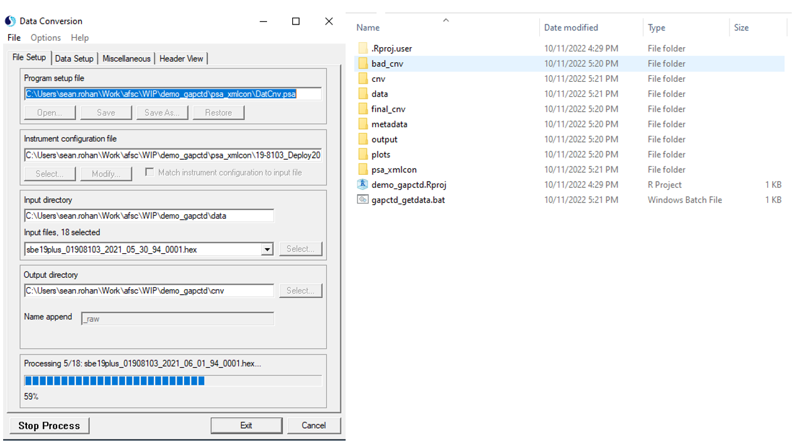
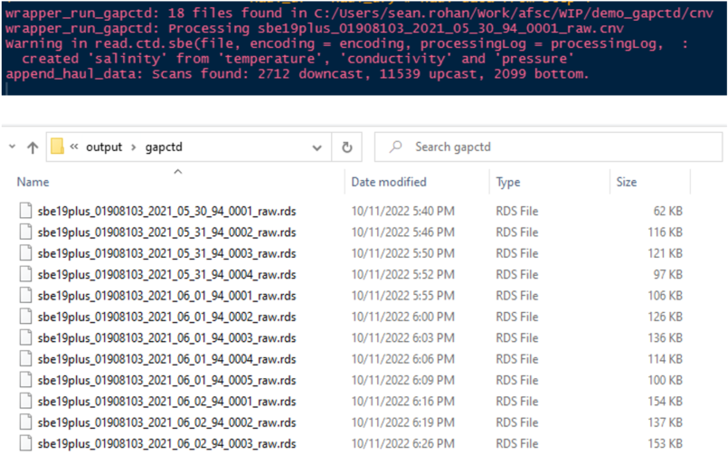
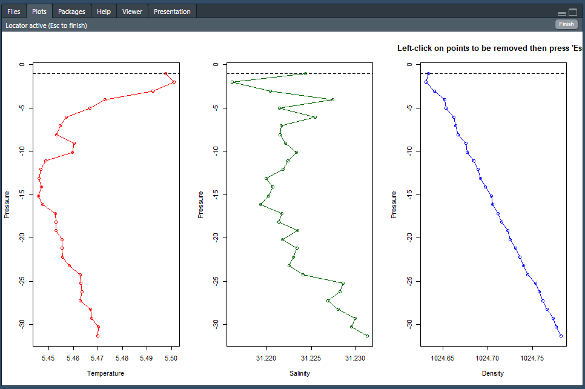
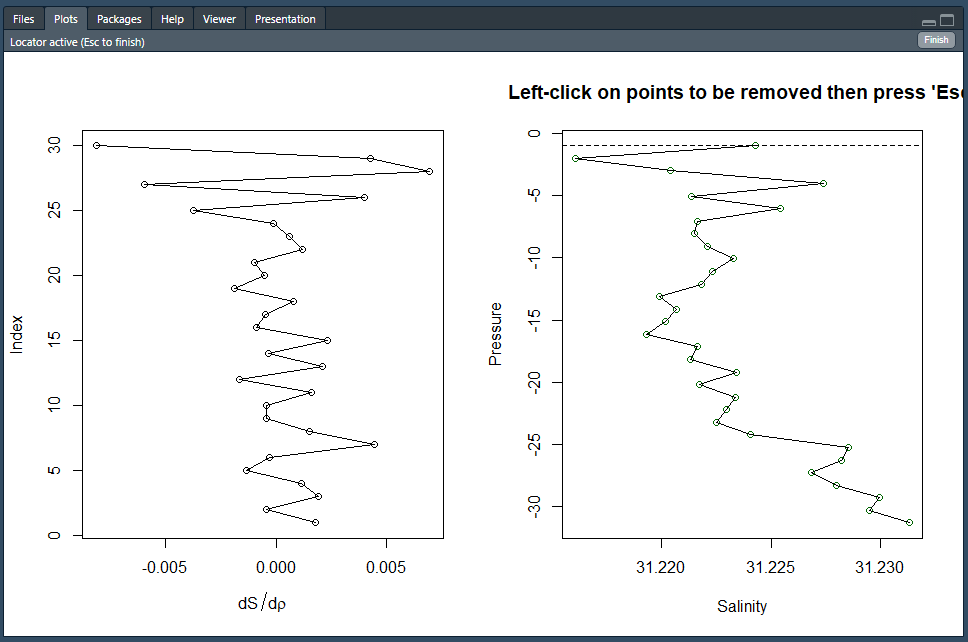
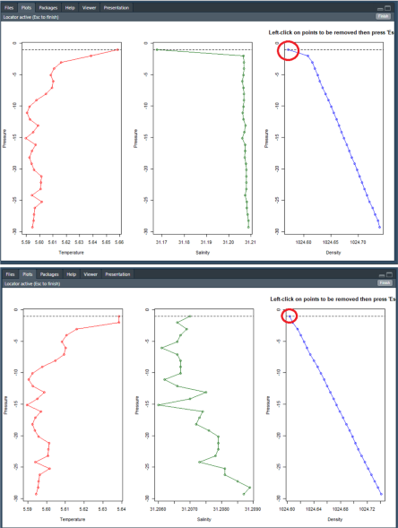
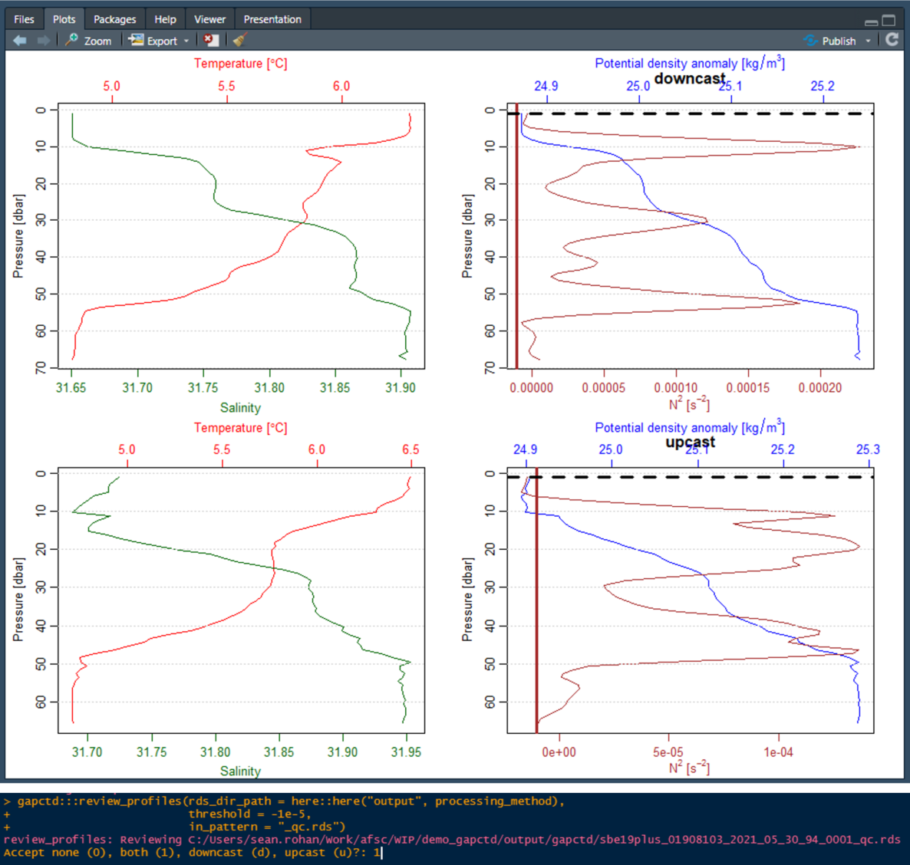
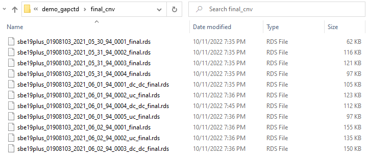

# Process CTD data in R using gapctd

The gapctd package processes CTD data collected during Alaska Fisheries
Science Center bottom trawl surveys. The entire data processing workflow
is run in R aside from decoding of raw data files in SBE Data Processing
Software. The gapctd package uses the [oce
package](https://dankelley.github.io/oce/) (Kelley et al., 2022) for
handling CTD data. Data are processed using R versions of modules from
SBE Data Processing software and methods for optimizing module
parameters that have been applied to underway CTD and glider data (Garau
et al., 2011; Ullman and Hebert, 2014).

The data processing workflow described below was developed for
processing data from Sea-Bird SBE19plus V2 CTDs with induction pumps
that are deployed on bottom-trawl survey gear in the eastern Bering Sea,
Gulf of Alaska, and Aleutian Islands.

## 1. Installation

Install SBE Data Processing software (available from the manufacturer)
and the gapctd package.

``` r
devtools::install_github("afsc-gap-products/gapctd")
```

## 2. Load package, define global variables, and connect to Oracle

Load the `gapctd` package. Assign vessel, cruise, and region (BS, GOA,
or AI) variables and set the source directory where CTD hex files and
.xmlcon file are stored.

``` r
library(gapctd)

# Select vessel, cruise, and region
vessel <- 94
cruise <- c(202101, 202202)
region <- "BS"
ctd_dir <- "G:/RACE_CTD/data/2021/ebs/v94_ctd1" # Directory w/ CTD data (.hex) and config (.xmlcon)
processing_method <- "gapctd"
```

## 3. Setup directory for processing

The `setup_gapctd_directory` function sets up the working directory for
processing data from a single CTD, vessel, and cruise. Raw CTD data
files (.hex) and configuration files (.xmlcon) are copied from the
source directory, ctd_dir, to the /data/ and /psa_xmlcon/ directories.
Then, the SBE Data Processing DatCnv module is run using system commands
to convert .hex files to human-readable decoded CTD data files (.cnv)
that get saved in the /cnv/ directory.

*Note: A new directory/project will need to setup for each
cruise/vessel/CTD combination.*

``` r
gapctd:::setup_gapctd_directory(processing_method = processing_method, 
                                ctd_dir = ctd_dir)
```



## 4. Retrieve haul data from RACEBASE

The `get_haul_data` function retrieves haul data for a vessel/cruise
from RACEBASE and writes the haul data to an R data file (
/output/HAUL_DATA\_\[vessel\]\_\[cruise\].rds).

``` r
# Establish Oracle connection connection
channel <- gapctd::get_connected(schema = "AFSC")

# Get haul data from RACEBASE and write to an .rds file in /output/
haul_df <- gapctd:::get_haul_data(channel = channel,
                                  vessel = vessel,
                                  cruise = cruise,
                                  tzone = "America/Anchorage")

# Load haul data
haul_df <- readRDS(file = here::here("output", 
                                     paste0("HAUL_DATA_", vessel, "_", paste(cruise, collapse = "_"), ".rds")))
```

The tzone = “America/Anchorage” argument specifies the timezone to use
for haul event times in RACEBASE that are stored in UTC.


## 5. Run gapctd processing methods on CTD files

The `wrapper_run_gapctd` function implements the `run_gapctd` function
on each CTD file in the working directory. The `run_gapctd` function
processes data for a single CTD data file (.cnv) using the [processing
steps](./doc/batch_processing_steps.md) we have found works best for our
deployments across bottom trawl survey regions.

*Note: wrapper_run_gapctd takes 8+ hours to run for a full
vessel/cruise.*

``` r
# Run data processing algorithm on files. Write .rds
gapctd:::wrapper_run_gapctd(cnv_dir_path = here::here("cnv"), # Path to decoded CTD data (.cnv) files
                            processing_method = processing_method, # Processing method
                            haul_df = haul_df) # Haul data from step 4
```

Outputs from `wrapper_run_gapctd` are stored in oce objects that are
saved in R data (.rds) files in /output/gapctd/
[(example)](./doc/ctd_data_files.md). The files include three segments
for each deployment (downcast, bottom, upcast). Haul metadata are
included with each of the segments. If any segment is missing, it will
not be included in the file (i.e., if the CTD shut-off during the
deployment and there is no upcast data, there will not be an upcast file
in the object).



## 6. Make metadata file

The `make_metadata_file` function reads in R data (.rds) files from each
casts, calculates haul-level averages from bottom samples (i.e., mean
bottom salinity, mean bottom temperature), and retrieves other metadata
that are included in the data product. The data are then written to the
file path specified using the output_path argument. This is the last
time bottom data will be used in processing.

``` r
# Make metadata and bottom averages file
gapctd:::make_metadata_file(rds_dir_path = here::here("output", "gapctd"),
                            in_pattern = "_raw.rds",
                            output_path = here::here("metadata", 
                                                     paste0("CTD_HAUL_DATA_", vessel, "_", paste(cruise, collapse = "_"), ".rds")))
```


## 7. Run basic data quality checks

The `move_bad_rds` function checks data files from each deployment for
common errors in downcast and upcast profiles. Files with bad upcasts or
downcasts are moved to /bad_cnv/ while good casts are retained in the
/output/gapctd/ directory. If only one of the casts from a deployment
fails data quality checks, the good profile is retained in the
/output/gapctd directory.

``` r
# Move 'bad' files to bad_cnv
gapctd:::move_bad_rds(rds_dir_path = here::here("output", processing_method))
```


## 8. Visually inspect, flag, and interpolate bad data (first round)

*IMPORTANT: For this step, your display/GUI must be set to Actual Size
in R Studio! Use the drop down menu (View \> Actual Size) to set your R
Studio display to Actual Size*

There are often dynamic errors in profiles after the automated
processing steps that typically appear as large salinity spikes. The
`qc_flag_interpolate` function provides a graphical user interface that
allows users to inspect plots of profile data for selected data and
select erroneous data that should be removed and interpolated. The
`wrapper_flag_interpolate` function is a wrapper for
`qc_flag_interpolate`.

Please note that interpolation can sometimes behave in unintuitive ways
when interpolating salinity and density because the function
interpolates conductivity and temperature, not salinity and density.
Salinity and density are recalculated after interpolating conductivity
and temperature.

``` r
# Visually inspect, flag, and interpolate
gapctd:::wrapper_flag_interpolate(rds_dir_path = here::here("output", processing_method),
                                  review = c("density", "salinity"))
```

There are two sets of plots to review for every cast. Set \#1 shows
temperature, salinity, and density profiles. Set \#2 shows the rate of
change in salinity and salinity.

*The goal of this step is to flag large transient errors. Pay careful
attention to the range on the x-axis when assessing the magnitude of
spikes in the data.* Flags should not be applied to small errors and/or
errors that persist for multiple consecutive depth bins. Correcting
small and persistent errors is unnecessary because the other cast from a
deployment is often suitable or subsequent corrections may resolve the
errors.

#### Set 1

1.  Review the right panel for density errors.
2.  Left-click on any points in the right panel (density) that should be
    removed and interpolated. Do not select the points if there are
    errors in salinity that do not produce large errors in density.
3.  Press Esc. If any points were selected, conductivity and temperature
    for the selected pressure bin will be removed and salinity and
    pressure will be recalculated.
4.  Repeat 1-3 until there are no more errors to remove.

 Set 1 plots:
Pressure versus temperature (left), salinity (center), and density
(right)

#### Set 2: Rate of change in salinity (left) and salinity (right)

1.  Review the panels for salinity errors.
2.  Left-click on any points in the left panel (salinity) that should be
    removed and interpolated.
3.  Press Esc. If any points were selected, conductivity and temperature
    for the selected pressure bin will be removed and salinity and
    pressure will be recalculated.
4.  Repeat 1-3 until there are no more errors to remove.

 Set 2 plots: Rate
of change in salinity (left) and salinity (right)

 Selecting and
interpolating the shallowest density bin, showing before (top) and after
(bottom).

## 9. Select profiles to include in data product (first round)

The `review_profiles` function provides an interface for visually
inspecting profiles for each deployment and selecting the profiles to
include in the final data product. The goal of this step is to select
the profile(s) without dynamic errors (e.g., unreasonable salinity
spikes or density inversions).

``` r
# Review profiles
gapctd:::review_profiles(rds_dir_path = here::here("output", processing_method),
                         threshold = -1e-5, 
                         in_pattern = "_qc.rds")
```

Data from each deployment are displayed one at a time. If a downcast and
upcast are both available, both will be shown simultaneously. If only
one cast is available, only the downcast or upcast will be shown. The
plots on the left panel show temperature (red) and salinity (green)
versus depth. Plots on the right panel show density anomaly (blue) and
buoyancy frequency (brown) versus depth. If there is a vertical line on
the right panel, it shows the buoyancy frequency threshold below which
the water column is considered unstable.

Follow instructions in the console to select profiles to use in the
final data product: both casts (1), downcast (d), upcast (u), or none
(0). If both casts are available from a deployment but none are
selected, data from the cast will be reprocessed using a different
approach to conductivity cell thermal mass correction and profiles will
be reviewed again after processing.



## 10. Remedial corrections for conductivity cell thermal intertia errors

During this step, use the `remedial_ctm` to select deployments that
should be reprocessed using the alternative method for conductivity cell
thermal inertia error correction. Casts for each deployment are
displayed sequentially. Use the console to select deployments that
should be reprocessed (usually all casts).

In the alternative methods, conductivity cell thermal inertia parameters
are estimated for individual casts by minimizing the path distance of
the salinity curve instead of the primary method of estimating
parameters for both casts by minimizing the area between upcast and
downcast temperature-salinity curves.

``` r
# Examine rejected profiles and run cell thermal mass corrections with alternate values using split_ctm()
gapctd:::remedial_ctm(rds_path = here::here("output", processing_method),
                      haul_df = haul_df)
```


## 11. Visually inspect, flag, and interpolate bad data (first round)

Same as step \#8 but profiles are only reviewed if a profile from the
deployment was not already selected for inclusion in the final data
product.

*Note: * Outside of the program, keep track of which cast (downcast or
upcast) should be used in the data product. Keeping track of this is
important because profiles will be reviewed one at a time during the
next step. File IDs for deployments are displayed as messages in the
console.

``` r
##---- Second round of review
# Visually inspect, flag, and interpolate
gapctd:::wrapper_flag_interpolate(rds_dir_path = here::here("output", processing_method),
                                  review = c("density", "salinity"))
```

## 12. Select profiles to include in data product (first round)

Same as step \#9 except downcast and upcast data are displayed one at a
time even if both casts are available from a deployment. If the downcast
is selected, the upcast will not be reviewed. If no casts from a
deployment are accepted, data from the deployment will not be included
in the final data product.

``` r
# Review profiles
gapctd:::review_profiles(rds_dir_path = here::here("output", processing_method),
                         threshold = -1e-5, 
                         in_pattern = "_qc.rds")
```

## 13. Finalize data

Move all of the accepted profiles from /output/gapctd/ to the
/final_cnv/ directory.

``` r
# Finalize
finalize_data(rds_dir_path = here::here("output", processing_method))
```



## 14. Prepare the data product

[Prepare the data product](./doc/prepare_data_product.md) if all data
from the survey have been processed and are in different directories.

## References

Garau, B., Ruiz, S., Zhang, W. G., Pascual, A., Heslop, E., Kerfoot, J.,
& Tintoré, J. (2011). Thermal lag correction on slocum CTD glider data.
Journal of Atmospheric and Oceanic Technology, 28(9), 1065–1071.
<https://doi.org/10.1175/JTECH-D-10-05030.1>

Kelley, D. E., Richards, C., & Layton, C. (2022). oce: an R package for
Oceanographic Analysis. Journal of Open Source Software, 7(71), 3594.
<https://doi.org/10.21105/joss.03594>

Ullman, D. S., & Hebert, D. (2014). Processing of underway CTD data.
Journal of Atmospheric and Oceanic Technology, 31(4), 984–998.
<https://doi.org/10.1175/JTECH-D-13-00200.1>
