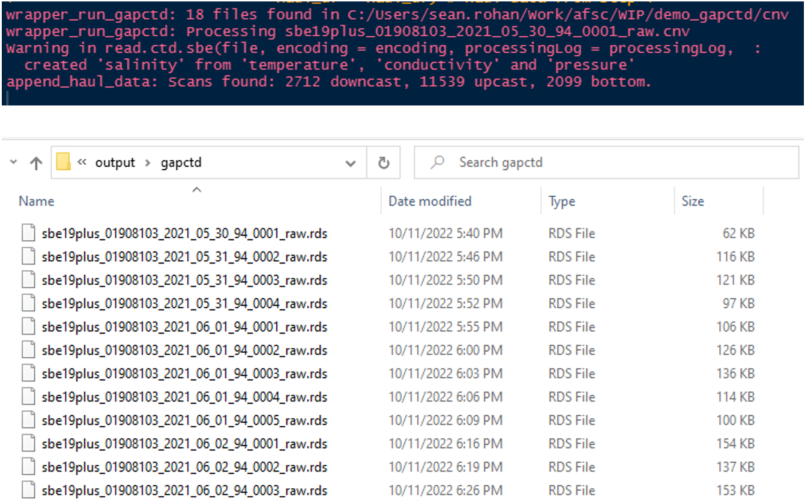
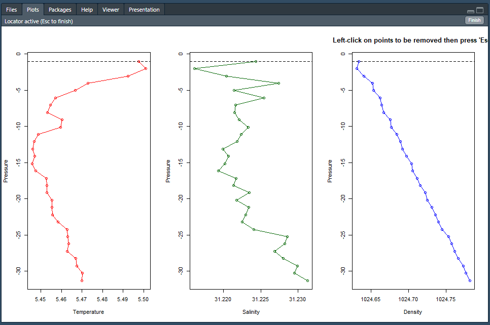
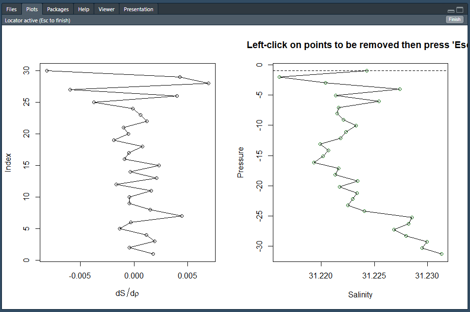
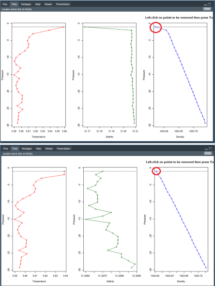
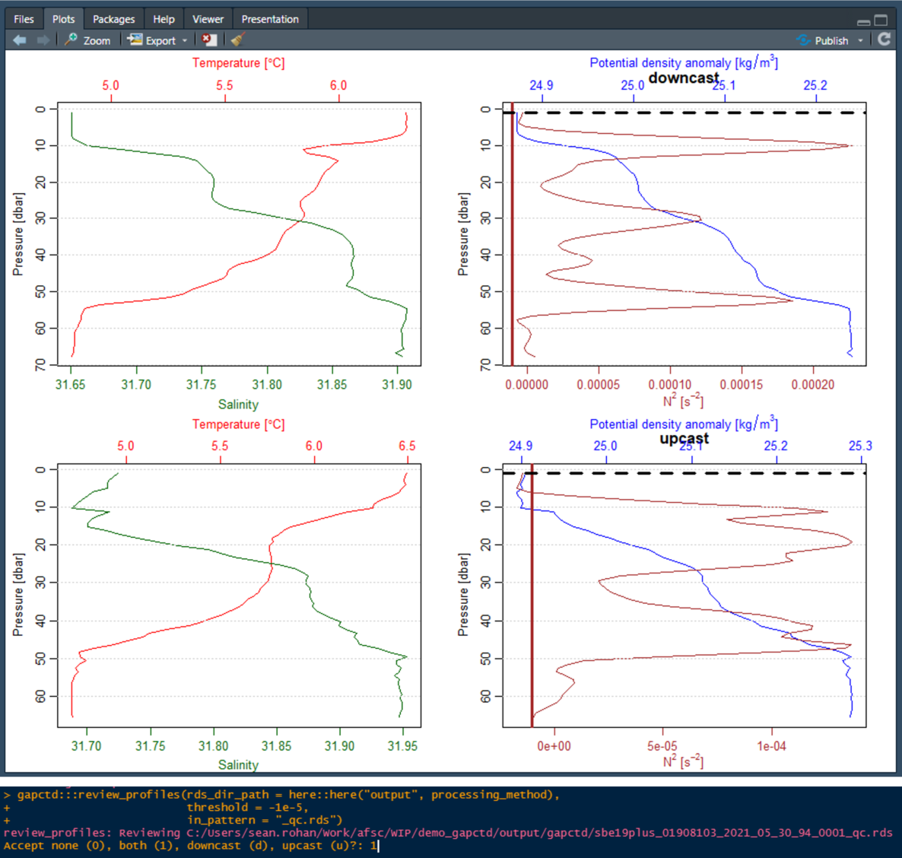

# Batch process CTD data in R

The gapctd package processes CTD data collected during Alaska Fisheries Science Center bottom trawl surveys. The entire data processing workflow is run in R aside from decoding of raw data files in SBE Data Processing Software. The gapctd package uses the [oce package](https://dankelley.github.io/oce/) (Kelley et al., 2022) for handling CTD data. Data are processed using R versions of modules from SBE Data Processing software and methods for optimizing module parameters that have been applied to underway CTD and glider data (Garau et al., 2011; Ullman and Hebert, 2014). 

The data processing workflow described below was developed for processing data from Sea-Bird SBE19plus V2 CTDs with induction pumps that are deployed on bottom-trawl survey gear in the eastern Bering Sea, Gulf of Alaska, and Aleutian Islands.

## 1. Installation

Install SBE Data Processing software (available from the manufacturer) and the gapctd package.

```{r install, include=TRUE, eval=FALSE}
devtools::install_github("afsc-gap-products/gapctd")
```


## 2. Load package, define global variables, and connect to Oracle

Load the `gapctd` package. Assign vessel, cruise, and region (BS, GOA, or AI) variables and set the source directory where CTD hex files and .xmlcon file are stored.

```{r setup, include=TRUE, eval=FALSE}
library(gapctd)

# Select vessel, cruise, and region
vessel <- 94
cruise <- c(202101, 202202)
region <- "BS"
ctd_dir <- "G:/RACE_CTD/data/2021/ebs/v94_ctd1" # Directory w/ CTD data (.hex) and config (.xmlcon)
processing_method <- "gapctd"
```

## 3. Setup directory for processing

The `setup_gapctd_directory` function sets up the working directory for processing data from a single CTD, vessel, and cruise. Raw CTD data files (.hex) and configuration files (.xmlcon) are copied from the source directory, ctd_dir, to the /data/ and /psa_xmlcon/ directories. Then, the SBE Data Processing DatCnv module is run using system commands to convert .hex files to human-readable decoded CTD data files (.cnv) that get saved in the /cnv/ directory.

*Note: A new directory/project will need to setup for each cruise/vessel/CTD combination.*

```{r setup_directory, include = TRUE, eval=FALSE}
gapctd:::setup_gapctd_directory(processing_method = processing_method, 
                                ctd_dir = ctd_dir)
```


<p align = "center"><b>Left: SBE Data Processing converting raw data files after calling the setup_gapctd_directory(). Right: Contents of the working directory after successfully running setup_gapctd_directory().</b></p>

## 4. Retrieve haul data from RACEBASE

The `get_haul_data` function retrieves haul data for a vessel/cruise from RACEBASE and writes the haul data to an R data file ( /output/HAUL_DATA_[vessel]_[cruise].rds).

```{r get_haul_data, include = TRUE, eval = FALSE}
# Establish Oracle connection connection
channel <- gapctd::get_connected(schema = "AFSC")

# Get haul data from RACEBASE and write to an .rds file in /output/
haul_df <- gapctd:::get_haul_data(channel = channel,
                                  vessel = vessel,
                                  cruise = cruise,
                                  tzone = "America/Anchorage")

# Load haul data
haul_df <- readRDS(file = here::here("output", 
                                     paste0("HAUL_DATA_", vessel, "_", paste(cruise, collapse = "_"), ".rds")))
```

The tzone = "America/Anchorage" argument specifies the timezone to use for haul event times in RACEBASE that are stored in UTC.


<p align = "center"><b>Contents of the &#47;output&#47; directory after running get_haul_data(), showing the haul data file (HAUL_DATA_94_202101_202102.rds).</b></p>

## 5. Run gapctd processing methods on CTD files

The `wrapper_run_gapctd` function implements the `run_gapctd` function on each CTD file in the working directory. The `run_gapctd` function processes data for a single CTD data file (.cnv) using the [processing steps](./doc/batch_processing_steps.md) we have found works best for our deployments across bottom trawl survey regions.

*Note: wrapper_run_gapctd takes 8+ hours to run for a full vessel/cruise.*

```{r wrapper_run_gapctd, include=TRUE, eval=FALSE}
# Run data processing algorithm on files. Write .rds
gapctd:::wrapper_run_gapctd(cnv_dir_path = here::here("cnv"), # Path to decoded CTD data (.cnv) files
                            processing_method = processing_method, # Processing method
                            haul_df = haul_df) # Haul data from step 4
```

Outputs from `wrapper_run_gapctd` are stored in oce objects that are saved in R data (.rds) files in /output/gapctd/ [(example)](./doc/ctd_data_files.md). The files include three segments for each deployment (downcast, bottom, upcast). Haul metadata are included with each of the segments. If any segment is missing, it will not be included in the file (i.e., if the CTD shut-off during the deployment and there is no upcast data, there will not be an upcast file in the object).


<p align = "center"><b>Top: Console messages while running wrapper_run_gapctd(). Bottom: Contents of the &#47;output&#47;gapctd&#47; directory after successfully running wrapper_run_gapctd().</b></p>

## 6. Make metadata file

The `make_metadata_file` function reads in R data (.rds) files from each casts, calculates haul-level averages from bottom samples (i.e., mean bottom salinity, mean bottom temperature), and retrieves other metadata that are included in the data product. The data are then written to the file path specified using the output_path argument. This is the last time bottom data will be used in processing.


```{r make_metadata_file, include=TRUE, eval=FALSE}
# Make metadata and bottom averages file
gapctd:::make_metadata_file(rds_dir_path = here::here("output", "gapctd"),
                            in_pattern = "_raw.rds",
                            output_path = here::here("metadata", 
                                                     paste0("CTD_HAUL_DATA_", vessel, "_", paste(cruise, collapse = "_"), ".rds")))
```


<p align = "center"><b>Contents of the /metadata/ directory after running make_metadata_file(), showing the metadata file (CTD_HAUL_DATA_94_202101_202202.rds)</b></p>


## 7. Run basic data quality checks

The `move_bad_rds` function checks data files from each deployment for common errors in downcast and upcast profiles. Files with bad upcasts or downcasts are moved to /bad_cnv/ while good casts are retained in the /output/gapctd/ directory. If only one of the casts from a deployment fails data quality checks, the good profile is retained in the /output/gapctd directory.

```{r, move_bad_rds, include=TRUE, eval=FALSE}
# Move 'bad' files to bad_cnv
gapctd:::move_bad_rds(rds_dir_path = here::here("output", processing_method))
```


<p align = "center"><b>Contents of the &#47;bad_cnv&#47; directory after running move_bad_rds()</b></p>


## 8. Visually inspect, flag, and interpolate bad data (first round)

*IMPORTANT: For this step, your display/GUI must be set to Actual Size in R Studio! Use the drop down menu (View > Actual Size) to set your R Studio display to Actual Size*

There are often dynamic errors in profiles after the automated processing steps that typically appear as large salinity spikes. The `qc_flag_interpolate` function provides a graphical user interface that allows users to inspect plots of profile data for selected data and select erroneous data that should be removed and interpolated. The `wrapper_flag_interpolate` function is a wrapper for `qc_flag_interpolate`.

Please note that interpolation can sometimes behave in unintuitive ways when interpolating salinity and density because the function interpolates conductivity and temperature, not salinity and density. Salinity and density are recalculated after interpolating conductivity and temperature.

```{r flag_interpolate_1, include=TRUE, eval=FALSE}
# Visually inspect, flag, and interpolate
gapctd:::wrapper_flag_interpolate(rds_dir_path = here::here("output", processing_method),
                                  review = c("density", "salinity"))
```

There are two sets of plots to review for every cast. Set #1 shows temperature, salinity, and density profiles. Set #2 shows the rate of change in salinity and salinity.

_The goal of this step is to flag large transient errors. Pay careful attention to the range on the x-axis when assessing the magnitude of spikes in the data._ Flags should not be applied to small errors and/or errors that persist for multiple consecutive depth bins. Correcting small and persistent errors is unnecessary because the other cast from a deployment is often suitable or subsequent corrections may resolve the errors.


#### Set 1

1.  Review the right panel for density errors. 
2.  Left-click on any points in the right panel (density) that should be removed and interpolated. Do not select the points if there are errors in salinity that do not produce large errors in density.
3.  Press Esc. If any points were selected, conductivity and temperature for the selected pressure bin will be removed and salinity and pressure will be recalculated.
4.  Repeat 1-3 until there are no more errors to remove.


<p align = "center"><b>Set 1 plots: Pressure versus temperature (left), salinity (center), and density (right).</b></p>

#### Set 2

1.  Review the panels for salinity errors.
2.  Left-click on any points in the left panel (salinity) that should be removed and interpolated.
3.  Press Esc. If any points were selected, conductivity and temperature for the selected pressure bin will be removed and salinity and pressure will be recalculated.
4.  Repeat 1-3 until there are no more errors to remove.


<p align = "center"><b>Set 2 plots: Rate of change in salinity (left) and salinity (right).</b></p>

<br>

<p align = "center"><b>Example of selecting and interpolating showing set 1 profiles before (top) and after (bottom) removing data from the shallowest depth bin.</b></p>


## 9. Select profiles to include in data product (first round)

The `review_profiles` function provides an interface for visually inspecting profiles for each deployment and selecting the profiles to include in the final data product. The goal of this step is to select the profile(s) without dynamic errors (e.g., unreasonable salinity spikes or density inversions).

```{r review_profiles_1, include=TRUE, eval=FALSE}
# Review profiles
gapctd:::review_profiles(rds_dir_path = here::here("output", processing_method),
                         threshold = -1e-5, 
                         in_pattern = "_qc.rds")
```

Data from each deployment are displayed one at a time. If a downcast and upcast are both available, both will be shown simultaneously. If only one cast is available, only the downcast or upcast will be shown. 

Follow instructions in the console to select profiles to use in the final data product: both casts (1), downcast (d), upcast (u), or none (0). If both casts are available from a deployment but none are selected, data from the cast will be reprocessed using a different approach to conductivity cell thermal mass correction and profiles will be reviewed again after processing.


<p align = "center"><b>Plots: Downcast (top row of profile plots) and upcast (bottom row of profile plots). Left-side panels show temperature (red) and salinity (green) versus depth. Right-side panel show density anomaly (blue) and buoyancy frequency (brown) versus depth. A vertical line on the right panels shows the buoyancy frequency threshold below which the density structure of the water column could be considered unstable. R Console output: User interface for selecting casts.</b></p>

## 10. Remedial corrections for conductivity cell thermal intertia errors

During this step, use the `remedial_ctm` to select deployments that should be reprocessed using the alternative method for conductivity cell thermal inertia error correction. Casts for each deployment are displayed sequentially. Use the console to select deployments that should be reprocessed (usually all casts).

In the alternative methods, conductivity cell thermal inertia parameters are estimated for individual casts by minimizing the path distance of the salinity curve instead of the primary method of estimating parameters for both casts by minimizing the area between upcast and downcast temperature-salinity curves.

```{r remedial_ctm, include=TRUE, eval=FALSE}
# Examine rejected profiles and run cell thermal mass corrections with alternate values using split_ctm()
gapctd:::remedial_ctm(rds_path = here::here("output", processing_method),
                      haul_df = haul_df)
```


<p align = "center"><b>R console user interface for choosing casts for alternative conductivity cell thermal intertia correction.</b></p>

## 11. Visually inspect, flag, and interpolate bad data (first round)

Same as step #8 but profiles are only reviewed if a profile from the deployment was not already selected for inclusion in the final data product. 

*Note: * Outside of the program, keep track of which cast (downcast or upcast) should be used in the data product. Keeping track of this is important because profiles will be reviewed one at a time during the next step. File IDs for deployments are displayed as messages in the console.

```{r flag_interpolate_2, include=TRUE, eval=FALSE}
##---- Second round of review
# Visually inspect, flag, and interpolate
gapctd:::wrapper_flag_interpolate(rds_dir_path = here::here("output", processing_method),
                                  review = c("density", "salinity"))
```


## 12. Select profiles to include in data product (first round)

Same as step #9 except downcast and upcast data are displayed one at a time even if both casts are available from a deployment. If the downcast is selected, the upcast will not be reviewed. If no casts from a deployment are accepted, data from the deployment will not be included in the final data product.

```{r review_profiles_2, include=TRUE, eval=FALSE}
# Review profiles
gapctd:::review_profiles(rds_dir_path = here::here("output", processing_method),
                         threshold = -1e-5, 
                         in_pattern = "_qc.rds")
```


## 13. Finalize data

Move all of the accepted profiles from /output/gapctd/ to the /final_cnv/ directory.

```{r finalize, include=TRUE, eval=FALSE}
# Finalize
finalize_data(rds_dir_path = here::here("output", processing_method))
```


<p align = "center"><b>Final profile data in the &#47;final_cnv&#47; directory.</b></p>

## 14. Prepare the data product

[Prepare the data product](./doc/prepare_data_product.md) if all data from the survey have been processed and are in different directories.


## References

Garau, B., Ruiz, S., Zhang, W. G., Pascual, A., Heslop, E., Kerfoot, J., & Tintoré, J. (2011). Thermal lag correction on slocum CTD glider data. Journal of Atmospheric and Oceanic Technology, 28(9), 1065–1071. [https://doi.org/10.1175/JTECH-D-10-05030.1](https://doi.org/10.1175/JTECH-D-10-05030.1)

Kelley, D. E., Richards, C., & Layton, C. (2022). oce: an R package for Oceanographic Analysis. Journal of Open Source Software, 7(71), 3594. [https://doi.org/10.21105/joss.03594](https://doi.org/10.21105/joss.03594)

Ullman, D. S., & Hebert, D. (2014). Processing of underway CTD data. Journal of Atmospheric and Oceanic Technology, 31(4), 984–998. [https://doi.org/10.1175/JTECH-D-13-00200.1](https://doi.org/10.1175/JTECH-D-13-00200.1)
