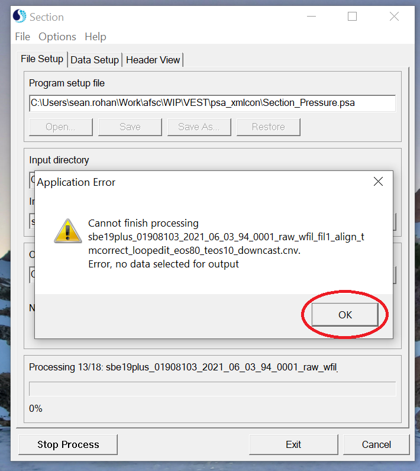
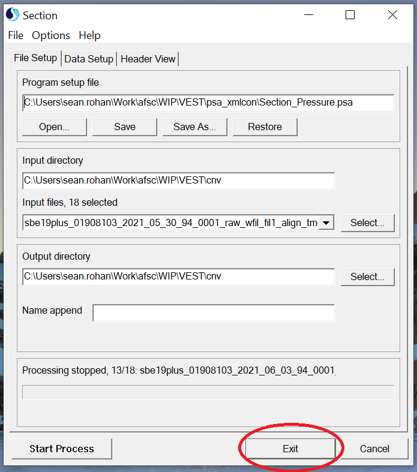
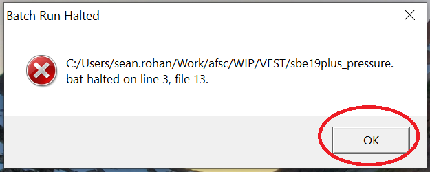
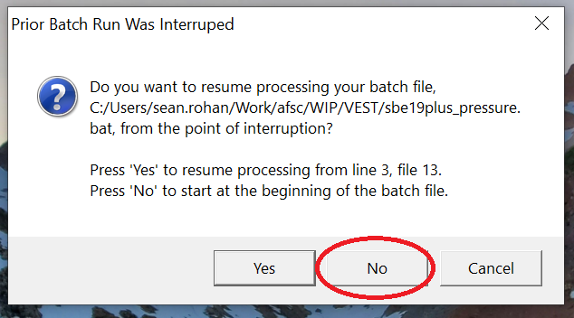

# SBE Data Processing Errors

SBE Data Processing modules sometimes have errors during batch processing. In the cases I've evaluated, these errors tend to show up when there are no usable data in a file (or sometimes just the upcast/downcast portion of the file). In most cases, you can simply ignore the and move on to the next file. Instructions for skipping through errors are below.

1. Click 'OK' in the Application Error pop-up (if shown)

2. Click 'Exit' in the SBE Data Processing Module window. In this case, it's the Section module window because there are no upcast data for the haul.

3. Click 'OK' in the Batch Run Halted pop-up. R and SBE data processing should skip to the next file.

4. Click 'No' in the Prior Batch Run Was Interrupted pop-up. Clicking 'No' ensures that processing for the new file starts with the first line in a batch file, instead of on the line where the last file had an error.

