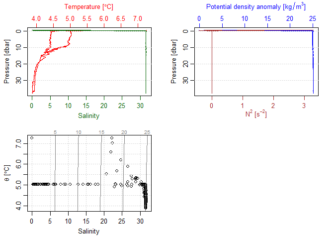
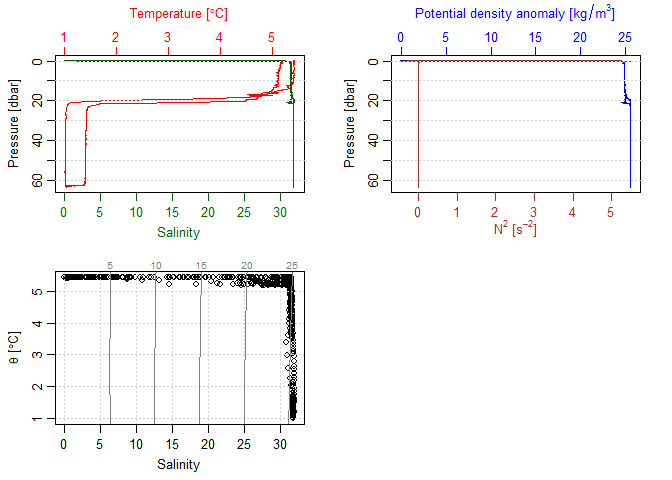

# Convert hexadecimal files to cnv

The gapctd package can convert Sea-Bird CTD hexadecimal files (.hex) to
.cnv file with variables in scientific units. Currently, `hex_to_cnv()`
supports SBE19plus temperature, conductivity, pressure, and flags, along
with data from SBE43 dissolved oxygen and SBE18 pH sensors. The default
outputs are:

-   Temperature \[ITS-90, degrees C\]
-   Conductivity \[S/m\]
-   Pressure \[decibars\]
-   Data quality flags
-   Dissolved oxygen \[voltage\]
-   pH

Note that the cnv file created by `hex_to_cnv()` does not include
derived quantities that depend on dynamic error corrections from primary
channels (e.g. salinity, density, dissolved oxygen). The
`oce::read.ctd()` package automatically calculates PSS-78 when it is not
provided, although this value should not be used directly. Dynamic
errors should first be corrected (see [Data processing
modules](./doc/data_processing_modules.md), [Batch processing
steps](./doc/batch_processing_steps.md), and [Batch processing
instructions and example](./doc/0_batch_processing.md))

This code below uses hexadecimal and configuration (.xmlcon) files as
inputs to generate a .cnv file named 2021\_06\_24\_0001.cnv. The data
are then loaded as `ctd` objects using the oce package.

#### Converting data without auxillary sensors

    library(gapctd)

    hex_to_cnv(hex_path = system.file("extdata/example/2021_06_24_0001.hex", package = "gapctd"),
               xmlcon_path = system.file("extdata/example/19-8102_Deploy2021.xmlcon", package = "gapctd"),
               output_path = "2021_06_24_0001.cnv")

    dat <- oce::read.oce(file = "2021_06_24_0001.cnv")

    ## Warning in read.ctd.sbe(file, encoding = encoding, processingLog =
    ## processingLog, : created 'salinity' from 'temperature', 'conductivity' and
    ## 'pressure'

    plot(dat)

#### Converting data with dissolved oxygen and pH sensors

    library(gapctd)

    hex_to_cnv(hex_path = system.file("extdata/example/SBE19plus_01908106_2023_06_19_0001.hex", package = "gapctd"),
               xmlcon_path = system.file("extdata/example/SBE19plusV2_8106_ph_DO_leg2.xmlcon", package = "gapctd"),
               output_path = "SBE19plus_01908106_2023_06_19_0001.cnv")

    dat_doph <- oce::read.oce(file = "SBE19plus_01908106_2023_06_19_0001.cnv")

    ## Warning in read.ctd.sbe(file, encoding = encoding, processingLog =
    ## processingLog, : created 'salinity' from 'temperature', 'conductivity' and
    ## 'pressure'

    plot(dat_doph)

    head(as.data.frame(dat_doph@data))

    ##   timeS temperature pressure conductivity oxygenRaw    pH flag    salinity
    ## 1  0.00      5.4241   -0.132     0.000314  3.334707 6.685    0 0.003690580
    ## 2  0.25      5.4241   -0.126     0.000311  3.335470 6.685    0 0.003672702
    ## 3  0.50      5.4241   -0.132     0.000311  3.336767 6.684    0 0.003672703
    ## 4  0.75      5.4243   -0.129     0.000305  3.334783 6.686    0 0.003637137
    ## 5  1.00      5.4244   -0.129     0.000305  3.335088 6.684    0 0.003637194
    ## 6  1.25      5.4244   -0.135     0.000298  3.334173 6.683    0 0.003595694
