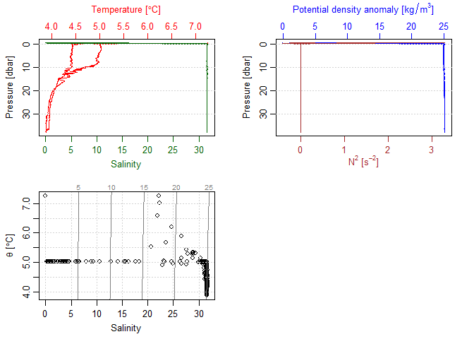

# Convert hexadecimal files to cnv

The gapctd package can convert Sea-Bird CTD hexadecimal files (.hex) to
.cnv file with variables in scientific units. Currently, `hex_to_cnv()`
supports SBE19plus temperature, conductivity, pressure, and flags, along
with data from SBE43 dissolved oxygen and SBE18 pH sensors. The default
outputs are:

-   Temperature \[ITS-90, degrees C\]
-   Conductivity \[S/m\]
-   Pressure \[decibars\]
-   Data quality flags
-   Dissolved oxygen \[voltage\]
-   pH \[voltage\]

The default output does not include salinity, oxygen, or other derived
quantities because additional processing is required to correct for
sensor lag times and dynamic errors.

This code below uses hexadecimal and configuration (.xmlcon) files as
inputs to generate a .cnv file named 2021\_06\_24\_0001.cnv. The data
are then loaded as `ctd` objects using the oce package.

#### Conversion

    library(gapctd)

    hex_to_cnv(hex_path = system.file("extdata/example/2021_06_24_0001.hex", package = "gapctd"),
               xmlcon_path = system.file("extdata/example/19-8102_Deploy2021.xmlcon", package = "gapctd"),
               output_path = "2021_06_24_0001.cnv")

#### Loading as ctd object

    dat <- oce::read.oce(file = "2021_06_24_0001.cnv")

    ## Warning in read.ctd.sbe(file, encoding = encoding, processingLog =
    ## processingLog, : created 'salinity' from 'temperature', 'conductivity' and
    ## 'pressure'

    plot(dat)

