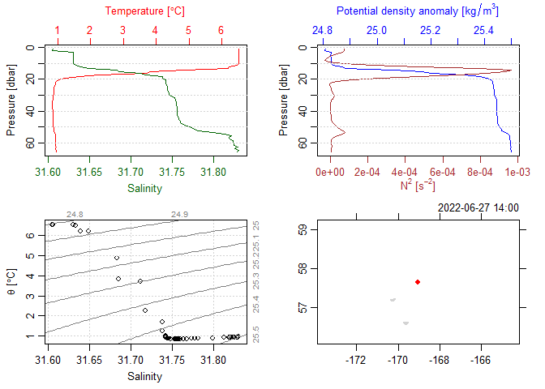

## Introduction

During processing, the gapctd package saves output to R data files
(.rds) to preserve data formats. These are subsequently used to generate
data products in netCDF files. Here, we show how the contents of the rds
files are structured.

Load the gapctd package and read in data from a fully-processed
deployment using the readRDS function. The file contains a list of three
objects with class ctd, a class from the oce package. Each of the
objects contains data from different segments of the deployment:
downcast, bottom, and upcast.

``` r
library(gapctd)

ctd_data <- readRDS(file = system.file("extdata/ex_ctd_file.rds", package = "gapctd"))

class(ctd_data)
summary(ctd_data)
```

    ## [1] "list"

    ##          Length Class Mode
    ## downcast 1      ctd   S4  
    ## upcast   1      ctd   S4  
    ## bottom   1      ctd   S4

## Data

Data from a segment are stored in a list named *data* that contains
vectors of data for the individual variables. Below, the contents of the
*data* list are shown after conversion to a data.frame for the purpose
of illustration.

``` r
head(
  as.data.frame(ctd_data$downcast@data)
  )
```

    ##   depth flag    timeS temperature conductivity salinity        C_corr  velocity
    ## 1 1.001    7 259.0574    6.520643     3.178194  31.6054 -3.905410e-04 0.1395574
    ## 2 2.003    0 358.2903    6.520643     3.178194  31.6049 -1.567742e-05 0.1242258
    ## 3 3.003    0 427.6500    6.510448     3.179684  31.6303 -3.200000e-06 0.1387333
    ## 4 4.004    0 435.8810    6.510214     3.179694  31.6302 -4.022658e-23 0.1504762
    ## 5 5.006    0 442.8750    6.512266     3.179927  31.6303  1.192308e-06 0.1592692
    ## 6 6.007    0 449.2500    6.505379     3.179368  31.6301 -5.200000e-06 0.1552800
    ##   absolute_salinity sound_speed  density        N2 pressure
    ## 1           31.6054     1472.55 1024.812  7.31e-05    1.009
    ## 2           31.6049     1472.56 1024.816  7.60e-05    2.019
    ## 3           31.6303     1472.57 1024.842  6.34e-05    3.028
    ## 4           31.6302     1472.59 1024.847  3.31e-05    4.037
    ## 5           31.6303     1472.61 1024.851  8.40e-06    5.047
    ## 6           31.6301     1472.60 1024.857 -9.30e-06    6.056

Note that the data are binned averages for 1-m depth bins.

## Metadata

Metadata from a segment are stored in a list named *metadata* that
contains vectors, lists, and data.frames of metadata. These data include
headers that were read-in from initial CTD data files, cast metadata,
and parameters used in SBE Data Processing modules.

#### Header from initial CTD data file

View the first six lines of the header.

``` r
head(ctd_data$downcast@metadata$header)
```

    ## [1] "* Sea-Bird SBE19plus  Data File:"                                                       
    ## [2] "* FileName = C:\\CTD\\202201_162_L2\\2022_06_27\\SBE19plus_01908101_2022_06_27_0003.hex"
    ## [3] "* Software version 2.8.0.119"                                                           
    ## [4] "* Temperature SN = 8101"                                                                
    ## [5] "* Conductivity SN = 8101"                                                               
    ## [6] "* System UpLoad Time = Jun 27 2022 18:14:56"

#### Survey metadata

There are two types of cast metadata. Some are standard for oce objects,
such as:

``` r
ctd_data$downcast@metadata$latitude
```

    ## [1] 57.65684

Other types of metadata are unique to gapctd processing because they are
useful for analyzing survey data. For example, the metadata list
includes a data.frame with metada data from the AFSC database:

``` r
ctd_data$downcast@metadata$race_metadata
```

    ##     VESSEL CRUISE HAUL           ON_BOTTOM            HAULBACK
    ## 174    162 202201   98 2022-06-27 22:11:55 2022-06-27 22:41:34
    ##              OFF_BOTTOM BOTTOM_DEPTH STATIONID GEAR_DEPTH GEAR_TEMPERATURE
    ## 174 2022-06-27 22:42:54           69      I-19         67              0.9
    ##     SURFACE_TEMPERATURE PERFORMANCE HAUL_TYPE          START_TIME
    ## 174                 6.3           0         3 2022-06-27 14:11:55
    ##     START_LATITUDE START_LONGITUDE END_LATITUDE END_LONGITUDE
    ## 174       57.65684       -169.0341     57.68195     -169.0453
    ##                dc_start              dc_end            uc_start
    ## 174 2022-06-27 14:00:09 2022-06-27 22:12:25 2022-06-27 22:41:04
    ##                  uc_end missing_section
    ## 174 2022-06-27 14:50:06           FALSE
    ##                                                                                              filename
    ## 174 C:\\Users\\sean.rohan\\Work\\afsc\\WIP\\2022_AKK\\cnv\\sbe19plus_01908101_2022_06_27_0003_raw.cnv
    ##                              deploy_id
    ## 174 sbe19plus_01908101_2022_06_27_0003

#### Data processing parameters

The object includes parameter settings that were used to run data
processing modules. For this cast, there are parameters that were
estimated for temperature alignment and conductivity cell thermal mass
correction:

``` r
# Temperature alignment
ctd_data$downcast@metadata$align
```

    ## best_offset   best_corr 
    ##  -0.5700000   0.9998825

``` r
# Conductivity cell thermal mass correction
ctd_data$downcast@metadata$ctm$downcast
```

    ##    alpha_C     beta_C 
    ## 0.01892234 0.25370295

#### Processing Log

Processing steps that were applied to the segment are stored in a list
named *processingLog* that contains vectors of processing steps and time
stamps.

## Plotting

The oce package includes convenient methods for plotting data in ctd
objects using base R, such as this four-panel plot below that utilizes
the metadata to show the location where the data were collected:

``` r
plot(ctd_data$downcast)
```

<!-- -->
