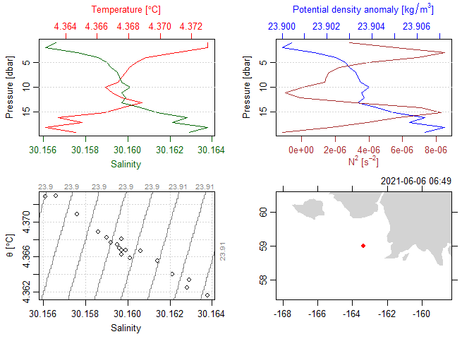

## Introduction

During processing, the gapctd package saves output to R data files
(.rds) to preserve data formats. These are subsequently used to generate
data products in netCDF files. Here, we show how the contents of the rds
files are structured.

Load the gapctd package and read in data from a fully-processed
deployment using the readRDS function. The file contains a list of three
objects with class ctd, a class from the oce package. Each of the
objects contains data from different segments of the deployment:
downcast, bottom, and upcast.

``` r
library(gapctd)
```

    ## Loading required package: ggplot2

    ## Warning: package 'ggplot2' was built under R version 4.1.3

    ## Loading required package: dplyr

    ## Warning: package 'dplyr' was built under R version 4.1.3

    ## 
    ## Attaching package: 'dplyr'

    ## The following objects are masked from 'package:stats':
    ## 
    ##     filter, lag

    ## The following objects are masked from 'package:base':
    ## 
    ##     intersect, setdiff, setequal, union

    ## Loading required package: tidyr

    ## Warning: package 'tidyr' was built under R version 4.1.3

    ## Loading required package: oce

    ## Warning: package 'oce' was built under R version 4.1.3

    ## Loading required package: gsw

    ## Loading required package: here

    ## here() starts at C:/Users/sean.rohan/Work/afsc/gapctd

    ## Loading required package: bbmle

    ## Warning: package 'bbmle' was built under R version 4.1.3

    ## Loading required package: stats4

    ## 
    ## Attaching package: 'bbmle'

    ## The following object is masked from 'package:dplyr':
    ## 
    ##     slice

    ## Loading required package: sf

    ## Warning: package 'sf' was built under R version 4.1.3

    ## Linking to GEOS 3.10.2, GDAL 3.4.1, PROJ 7.2.1; sf_use_s2() is TRUE

``` r
ctd_data <- readRDS(file = system.file("extdata/ex_ctd_file.rds", package = "gapctd"))

class(ctd_data)
```

    ## [1] "list"

``` r
summary(ctd_data)
```

    ##          Length Class Mode
    ## downcast 1      ctd   S4  
    ## upcast   1      ctd   S4  
    ## bottom   1      ctd   S4

## Data

Data from a segment are stored in a list named *data* that contains
vectors of data for the individual variables. Below, the contents of the
*data* list are shown after conversion to a data.frame for the purpose
of illustration.

``` r
head(
  as.data.frame(ctd_data$downcast@data)
  )
```

    ##   depth flag    timeS temperature conductivity salinity        C_corr  velocity
    ## 1 1.001    7 268.4936    4.373045     2.874601  30.1566 -1.056410e-05 0.1427179
    ## 2 2.003    0 367.3977    4.373045     2.874601  30.1561 -3.181818e-06 0.1668182
    ## 3 3.003    0 372.5000    4.371038     2.874613  30.1576 -3.307692e-06 0.3063846
    ## 4 4.005    0 378.7614    4.369141     2.874598  30.1586 -1.954545e-06 0.1476364
    ## 5 5.006    0 384.6250    4.368505     2.874618  30.1590 -4.500000e-07 0.2086000
    ## 6 6.008    0 389.3750    4.368050     2.874643  30.1592 -7.222222e-07 0.2232222
    ##   absolute_salinity sound_speed  density      N2 pressure
    ## 1           30.1566     1461.98 1023.905 2.8e-06    1.009
    ## 2           30.1561     1461.99 1023.909 5.6e-06    2.019
    ## 3           30.1576     1462.00 1023.916 8.5e-06    3.028
    ## 4           30.1586     1462.01 1023.921 6.9e-06    4.038
    ## 5           30.1590     1462.03 1023.926 3.9e-06    5.047
    ## 6           30.1592     1462.04 1023.931 2.2e-06    6.057

Note that the data are binned averages for 1-m depth bins.

## Metadata

Metadata from a segment are stored in a list named *metadata* that
contains vectors, lists, and data.frames of metadata. These data include
headers that were read-in from initial CTD data files, cast metadata,
and parameters used in SBE Data Processing modules.

#### Header from initial CTD data file

View the first six lines of the header.

``` r
head(ctd_data$downcast@metadata$header)
```

    ## [1] "* Sea-Bird SBE19plus  Data File:"                                                         
    ## [2] "* FileName = C:\\CTD\\202101_94_L1\\2021_06_06\\SBE19plus_01908105_2021_06_06_94_0001.hex"
    ## [3] "* Software version 2.8.0.119"                                                             
    ## [4] "* Temperature SN = 8105"                                                                  
    ## [5] "* Conductivity SN = 8105"                                                                 
    ## [6] "* System UpLoad Time = Jun 06 2021 21:25:17"

#### Survey metadata

There are two types of cast metadata. Some are standard for oce objects,
such as:

``` r
ctd_data$downcast@metadata$latitude
```

    ## [1] 59.00566

Other types of metadata are unique to gapctd processing because they are
useful for analyzing survey data. For example, the metadata list
includes a data.frame with metada data from the AFSC database:

``` r
ctd_data$downcast@metadata$race_metadata
```

    ##    VESSEL CRUISE HAUL           ON_BOTTOM            HAULBACK
    ## 91     94 202101   31 2021-06-06 14:58:12 2021-06-06 15:28:45
    ##             OFF_BOTTOM BOTTOM_DEPTH STATIONID GEAR_DEPTH GEAR_TEMPERATURE
    ## 91 2021-06-06 15:30:20           23      M-08         20              4.3
    ##    SURFACE_TEMPERATURE PERFORMANCE HAUL_TYPE          START_TIME START_LATITUDE
    ## 91                 4.2           0         3 2021-06-06 06:58:12       59.00566
    ##    START_LONGITUDE END_LATITUDE END_LONGITUDE            dc_start
    ## 91       -163.3406     58.97924     -163.3413 2021-06-06 06:49:57
    ##                 dc_end            uc_start              uc_end missing_section
    ## 91 2021-06-06 14:58:42 2021-06-06 15:28:15 2021-06-06 07:35:52           FALSE
    ##                                                                                                   filename
    ## 91 C:\\Users\\sean.rohan\\Work\\afsc\\WIP\\2021_VEST_1\\cnv\\sbe19plus_01908105_2021_06_06_94_0001_raw.cnv
    ##                                deploy_id
    ## 91 sbe19plus_01908105_2021_06_06_94_0001

#### Data processing parameters

The object includes parameter settings that were used to run data
processing modules. For this cast, there are parameters that were
estimated for temperature alignment and conductivity cell thermal mass
correction:

``` r
# Temperature alignment
ctd_data$downcast@metadata$align
```

    ## best_offset   best_corr 
    ##  -1.0000000  -0.4943155

``` r
# Conductivity cell thermal mass correction
ctd_data$downcast@metadata$ctm$downcast
```

    ## alpha_C  beta_C 
    ##   0.001   1.000

#### Processing Log

Processing steps that were applied to the segment are stored in a list
named *processingLog* that contains vectors of processing steps and time
stamps.

## Plotting

The oce package includes convenient methods for plotting data in ctd
objects using base R, such as this four-panel plot below that utilizes
the metadata to show the location where the data were collected:

``` r
plot(ctd_data$downcast)
```

<!-- -->
