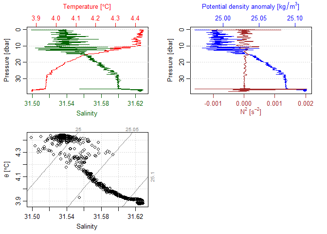
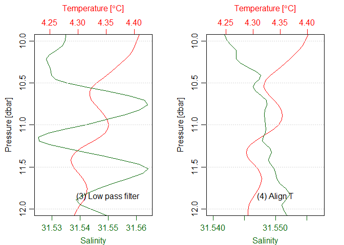
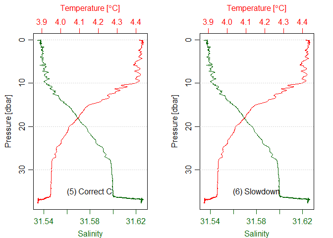
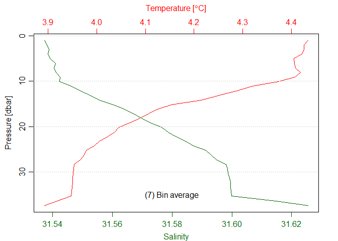

# Overview

The gapctd package includes modules (filters and operations) for
processing CTD data that are based on modules in SBE Data Processing
(SBEDP) software. The gapctd modules replicate the output of SBEDP
modules. However, the gapctd modules do not always include the full
range of processing options that are available in SBEDEP modules because
the gapctd modules are intended for limited use cases.

Modules accept and return `ctd` objects and are designed to be
interchangable (i.e., the order in which they are used can be swapped).
This document describes the modules and demonstrates their use for
processing CTD data.

# Load example data

Read-in the example CTD deployment file (.cnv) as a `ctd` object using
the `read.oce` function from the oce package. The deployment file
contains five variable columns that are populated in the oce object. A
sixth field, salinity (simply called ‘salinity’), is derived when the
data are read-in using `read.oce`.

| CTD File (.cnv) Variable | `ctd` object Variable | Description                   |
|--------------------------|-----------------------|-------------------------------|
| timeS                    | timeS                 | Time, Elapsed \[seconds\]     |
| tv290C                   | temperature           | Temperature \[ITS-90, deg C\] |
| prdM                     | pressure              | Pressure, Strain Gauge \[db\] |
| c0S/m                    | conductivity          | Conductivity \[S/m\]          |
| flag                     | flag                  | Data quality flag             |
| \-                       | salinity              | Practical Salinity \[PSS-78\] |

The file includes data from the entire deployment but only the downcast
will be used for this demonstration. The `oce::ctdTrim` function is used
to automatically detect and remove scan data that were not in the
downcast.

``` r
library(gapctd)

ctd_data <- oce::read.oce(file = system.file("extdata/example/2021_06_24_0001_raw.cnv", package = "gapctd"))
dc <- oce::ctdTrim(ctd_data, method = "sbe")

# Assign correct time zone for CTD data (survey time)
dc@metadata$startTime <- lubridate::force_tz(dc@metadata$startTime, 
                                             tz = "America/Anchorage")

# Generate standard oce plot
plot(dc)
```

<!-- -->

# Modules

## Median window filter

The `median_filter()` module is based on the median filter option in the
SBEDP Window Filter (Wfilter) module. It calculates the median for
selected channels within a specified scan window. Below, the median
window filter is applied to temperature and conductivity channels for
five (5) scan windows (corresponding with 1.25 seconds for the SBE19plus
V2) and salinity is recalculated.

``` r
dc_1 <- gapctd::median_filter(dc, 
                              variables = c("temperature", "conductivity"),
                              window = c(5,5))
dc_1@data$salinity <- oce::swSCTp(dc_1) # Calculate salinity

par(mfrow = c(1,2))
plot(dc, which = 1, type = 'l')
text(x = 31.56, y = 35, labels = "(1) Raw Downcast")
plot(dc_1, which = 1, type = 'l')
text(x = 31.56, y = 35, labels = "(2) Median Filter\nT+C")
```

<!-- -->

## Lowpass filter

The `lowpass_filter()` module is based on the SBEDP Filter module.
Below, the filter is applied to temperature, conductivity, and pressure
channels with time constants of 0.5 s, 0.5 s, and 1 s, respectively.
Salinity is then recalculated.

``` r
dc_2 <-   gapctd::lowpass_filter(dc_1,
                                 variables = c("temperature", "conductivity", "pressure"),
                                 time_constant = c(0.5, 0.5, 1))
dc_2@data$salinity <- oce::swSCTp(dc_2) # Calculate salinity
```

<!-- -->

## Align channel

The `align_var()` module is based on the SBEDP Align (AlignCTD) module.
The module shifts channel data in time and interpolates between
measurements when alignment parameters are not factors of the scan
interval. In the example below, temperature is advanced by 0.5 seconds
and salinity is recalculated. Plots showing a close-up of the section
between 10 and 12 dbar.

``` r
dc_3 <-   gapctd::align_var(dc_2,
                            variables = "temperature", 
                            offset = -0.5)
dc_3@data$salinity <- oce::swSCTp(dc_3) # Calculate salinity
```

<!-- -->

## Conductivity cell thermal mass correction

The `conductivity_correction()` module is based on the SBEDP
Conductivity Cell Thermal Mass Correction (CellTM) module. The module
implements a discrete time filter on conductivity based on the sample
interval (freq_n), the initial conductivity error (alpha_C), and a time
decay constant (beta_C). The function uses the sample interval in the
data to estimate the sample interval if it is not provided.

Below, the conductivity correction is applied using the typical
parameters recommended by the CTD manufacturer and salinity is
recalculated.

``` r
dc_4 <- gapctd::conductivity_correction(dc_3,
                                        alpha_C = 0.04, 
                                        beta_C = 1/8,
                                        freq_n  = 0.25)
dc_4@data$salinity <- oce::swSCTp(dc_4)
```

<!-- -->

## Loop edit

The `loop_edit()` module is based on the SBEDP Loop Edit (loopedit)
module that flags slowdowns and reversals in scan data based on a
threshold.

``` r
dc_5 <- gapctd::loop_edit(dc_4,
                          min_speed = 0.1, 
                          window = 5, 
                          cast_direction = "downcast")
```

<!-- -->

Note that `loop_edit()` flags slowdowns and reversals but does not
remove them. As such, the plots above are identical even though
slowdowns and reversals were flagged in the data:

``` r
dc_4@data$flag[409:415]
```

    ## [1] 0 0 0 0 0 0 0

``` r
dc_5@data$flag[409:415]
```

    ## [1] -9 -9 -9 -9 -9 -9 -9

## Derive EOS

The `derive_eos()` module uses functions from the oce package to
calculate the following variables from scan data:

| Variable          | Description                                     | Method  | `oce` function       |
|-------------------|-------------------------------------------------|---------|----------------------|
| depth             | Depth \[m\]                                     | EOS-80  | swDepth()            |
| salinity          | Practical salinity \[PSS-78\]                   | EOS-80  | swSCTp(eos=“unesco”) |
| density           | In-situ density \[kg m^-3\]                     | EOS-80  | swRho()              |
| absolute_salinity | Absolute salinity                               | TEOS-10 | swSCTp(eos=“gsw”)    |
| N2                | Square of buoyancy frequency \[radians^2 s^-2\] |         | swN2()               |

``` r
dc_6 <- gapctd::derive_eos(dc_5)

head(as.data.frame(dc_6@data))
```

    ##    timeS temperature pressure conductivity flag salinity scan C_corr velocity
    ## 1 155.25      4.4349    0.123     2.998519   -9  31.5361  622  0e+00    0.000
    ## 2 155.50      4.4349    0.122     2.998515   -9  31.5360  623  0e+00    0.000
    ## 3 155.75      4.4349    0.121     2.998505   -9  31.5359  624  0e+00   -0.005
    ## 4 156.00      4.4348    0.119     2.998488   -9  31.5358  625  0e+00   -0.004
    ## 5 156.25      4.4346    0.118     2.998464   -9  31.5357  626 -1e-06   -0.003
    ## 6 156.50      4.4344    0.118     2.998436   -9  31.5356  627 -2e-06    0.002
    ##   depth absolute_salinity sound_speed  density         N2
    ## 1 0.122           31.5361     1463.99 1024.989  0.0001150
    ## 2 0.121           31.5360     1463.99 1024.989  0.0000333
    ## 3 0.120           31.5359     1463.99 1024.989 -0.0000398
    ## 4 0.118           31.5358     1463.99 1024.989 -0.0001602
    ## 5 0.117           31.5357     1463.99 1024.989 -0.0002074
    ## 6 0.117           31.5356     1463.98 1024.989 -0.0002074

## Bin average

The `bin_average()` module is based on the SBDEP Bin Average (BinAvg)
module. The module calculates means of variables by depth or pressure
bin, with bad scan (flag \< 0) data excluded. Binning can be performed
by pressure or depth bins and surface data can be excluded based on a
user-specified depth or pressure threshold (default = 0.5). In the
example below, means are calculated for 1 m depth bins and data from \<
0.5 m depth are excluded.

``` r
dc_7 <- gapctd::bin_average(dc_6, by = "depth", bin_width = 1)
```

<!-- -->

# Linking modules with pipe operators

To declutter the workspace, the entire workflow can be run using pipe
operators (native `|>` or magrittr `%>%` instead of producing output at
every step. This is because each module accepts and returns a `ctd`
object.

``` r
dc_8 <- dc |>
  gapctd::median_filter(variables = c("temperature", "conductivity"),
                        window = c(5,5)) |>
  gapctd::lowpass_filter(variables = c("temperature", "conductivity", "pressure"),
                         time_constant = c(0.5, 0.5, 1)) |>
  gapctd::align_var(variables = "temperature", 
                    offset = -0.5) |>
  gapctd::conductivity_correction(alpha_C = 0.04, 
                                  beta_C = 1/8) |>
  gapctd::loop_edit(min_speed = 0.1, 
                    window = 5, 
                    cast_direction = "downcast") |>
  gapctd::derive_eos() |>
  gapctd::bin_average(by = "depth", bin_width = 1)
```

<!-- --><!-- -->

# Modules for working with GAP data

The modules above can be used with any `ctd` object data from any CTD.
However, some modules are specifically been developed for processing
GAP’s CTD data, and their use is demonstrated below.

| Module                     | Purpose                                                                                                                                |
|----------------------------|----------------------------------------------------------------------------------------------------------------------------------------|
| `append_haul_data()`       | Adds haul metadata from RACEBASE to ctd objects based on CTD time stamps and event time stamps in RACEBASE.                            |
| `assign_metadata_fields()` | Assigns metadata fields to downcast or upcast fields based on user-specified cast_direction                                            |
| `section_oce()`            | Extracts a section (downcast, bottom, or upcast) from a ctd object based on scan time stamps and event time stamps in metadata fields. |

``` r
# Haul data from the same vessel/cruise/CTD as the data file
ex_haul <- readRDS(file = system.file("extdata/example/HAUL_DATA_162_202101_202102.rds", 
                                      package = "gapctd"))

dc@metadata$startTime <- lubridate::force_tz(dc@metadata$startTime, 
                                             tz = "America/Anchorage")

dc_9 <- dc |>
  gapctd:::append_haul_data(haul_df = ex_haul) |>
  gapctd::median_filter(variables = c("temperature", "conductivity"),
                        window = c(5,5)) |>
  gapctd::lowpass_filter(variables = c("temperature", "conductivity", "pressure"),
                         time_constant = c(0.5, 0.5, 1)) |>
  gapctd::align_var(variables = "temperature", 
                    offset = -0.5) |>
  gapctd:::assign_metadata_fields(cast_direction = "downcast") |>
  gapctd:::section_oce(by = "datetime",
                       cast_direction = "downcast") |>
  gapctd::conductivity_correction(alpha_C = 0.04, 
                                  beta_C = 1/8) |>
  gapctd::loop_edit(min_speed = 0.1, window = 5, cast_direction = "downcast") |>
  gapctd::derive_eos() |>
  gapctd::bin_average(by = "depth", bin_width = 1)

plot(dc_9)
```

<!-- -->

The modules for working with GAP CTD data appended location data to the
metadata object so now the location of the cast can be shown in the
standard oce plots.
