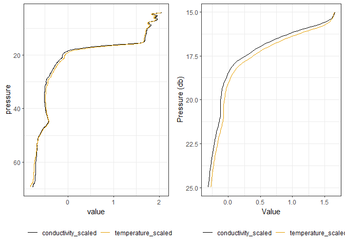
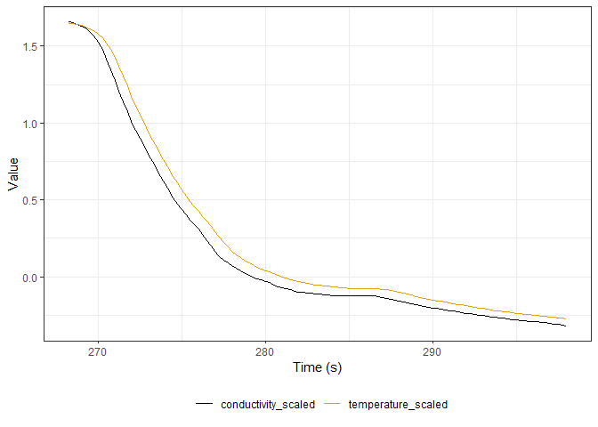
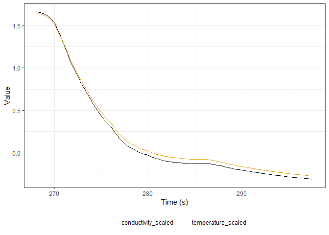

<p>
This document demonstrates how alignment parameters for the SBE Data
Processing module are estimated in the gapctd package using
`run_alignment_calcs` and `estimate_alignment`. Temperature alignments
are used in data processing because the thermistor on the SBE19plus
responds slower than strain gauge (pressure) and conductivity cell
measurements. The manufacturer recommends a dynamic correction using the
AlignCTD module to align temperature with conductivity and pressure
channels. Although the manufacturer recommendeds a typical alignment of
+0.5 seconds, the optimal value of the alignment can vary depending on
operating conditions.
</p>

## Load libraries and the OCE data set

Load the cnv data from an example deployment in the EBS in 2021 and
select downcast (timeS \< 455) scans where pressure \> 4 db. Data from
this deployment have not been aligned or corrected for thermal inertia
errors. When running functions to batch process the data in bulk,
internal functions will use metadata to select these scans
automatically.

``` r
library(gapctd)
library(ggthemes)
library(cowplot)
# Load OCE data set
ex_align <- read.oce(file = system.file("./extdata/ex_data/align_ex.cnv", package = "gapctd"))

ex_align_df <- data.frame(pressure = ex_align@data$pressure[ex_align@data$pressure > 4 & ex_align@data$timeS < 455],
           conductivity = ex_align@data$conductivity[ex_align@data$pressure > 4 & ex_align@data$timeS < 455],
           flag = ex_align@data$flag[ex_align@data$pressure > 4 & ex_align@data$timeS < 455],
           timeS = ex_align@data$timeS[ex_align@data$pressure > 4 & ex_align@data$timeS < 455],
           temperature = ex_align@data$temperature[ex_align@data$pressure > 4 & ex_align@data$timeS < 455])

# Center and scale
ex_align_df$temperature_scaled <- scale(ex_align_df$temperature)[,1]
ex_align_df$conductivity_scaled <- scale(ex_align_df$conductivity)[,1]
```

## Unaligned temperature and conductivity

If conductivity and temperature responses are aligned, values for both
are generally expected to change at the same depths when crossing
density gradients. However, Figure 1 shows that conductivity changes
faster than temperature in the profile data, presumably due to the
lagged response of the thermistor.



<i>Figure 1. Left: Scaled temperature and conductivity versus pressure;
Right: a close-up of the profile region around a density gradient
(pycnocline)</i>



<i>Figure 2. Time versus scaled temperature and conductivity for the
area around the density gradient.</i>

## Estimate the optimal temperature alignment

The `gapctd::estimate_alignment` function calculates the correlation
between rates of changes in two variables for different time adjustments
then returns the optimal time adjusment. In the function, the first
variable (var1) is not time-adjusted; time adjustments are applied to
the second variable (var2). In this case, the goal is to align
tempertaure to account for lagged thermistor measurements so the first
variable (var1) is conductivity and the second variable is temperature
(var2).

When alignments do not align exactly with scan intervals, the function
uses an interpolation method to estimate variable values at shifted
times. In other words, for a 4 Hz scan interval, the only perfect
alignments are in increments of 0.25s and for all other values,
variables are estimated.

``` r
alignment_calcs <- gapctd::estimate_alignment(var1 = ex_align_df$conductivity[ex_align_df$flag == 0], 
                           var2 = ex_align_df$temperature[ex_align_df$flag == 0], 
                           time1 = ex_align_df$timeS[ex_align_df$flag == 0], 
                           time2 = ex_align_df$timeS[ex_align_df$flag == 0], 
                           time2_adjustments = seq(-1.25, 1.25, 0.01), 
                           cor_method = "spearman", 
                           interp_method = "unesco", 
                           interp_fn = "oce.approx", 
                           only_return_adj = FALSE)
```

The output of `estimate_alignment` includes the optimal adjustment
(time2_adj), correlation for the optimal adjustment (adj_cor), and a
data.frame with alignment and optimal values (adj_est).

<i>Figure 3. Plot of alignment value versus correlation (Spearman’s
ρ<sup>2</sup>).</i>

## Align temperature

In batch processing, the package uses the alignment estimates from R to
make alignment corrections using the Alignment module in SBE Data
Processing. However, for illustrative purposes, the alignment using
methods from the `estimate_alignment` function are shown below.

After adjusting the temperature alignment by +0.59 seconds, the rate of
change in scaled conductivity and temperature curves match more closely
(Figure 4).

``` r
var1 <- ex_align_df$conductivity[ex_align_df$flag == 0]
var2 <- ex_align_df$temperature[ex_align_df$flag == 0]
pressure1 <- ex_align_df$pressure[ex_align_df$flag == 0]
pressure2 <- ex_align_df$pressure[ex_align_df$flag == 0]
time1 <- ex_align_df$timeS[ex_align_df$flag == 0]
time2 <- ex_align_df$timeS[ex_align_df$flag == 0]
time2_adjustments <- -0.59 # This is negative even though the alignment is positive because of how the function is setup.
cor_method <- "spearman"
interp_method <- "unesco"
interp_fn <- "oce.approx"

series_1 <- data.frame(t = time1,
                       p = pressure1,
                       x1 = var1)

s2_series <- data.frame(t = time2,
                        p = pressure2,
                        x1 = var2)

series_2 <- s2_series
series_2$t <- series_2$t + time2_adjustments[1]

loc_pred <- data.frame(locs = unique(c(series_1$t, series_2$t)))

loc_pred$s1 <- oce::oce.approx(x = series_1$t, 
                               y = series_1$x1, 
                               xout = loc_pred$locs, 
                               method = interp_method)

loc_pred$p1 <- oce::oce.approx(x = series_1$t, 
                               y = series_1$p, 
                               xout = loc_pred$locs, 
                               method = interp_method)

loc_pred$s2 <- oce::oce.approx(x = series_2$t, 
                               y = series_2$x1, 
                               xout = loc_pred$locs, 
                               method = interp_method)

loc_pred$p2 <- oce::oce.approx(x = series_2$t, 
                               y = series_2$p, 
                               xout = loc_pred$locs, 
                               method = interp_method)
```



<i>Figure 4. Conductivity and temperature with temperature alignment
shifted +0.59 seconds relative to pressure.</i>

Although the optimal alignment is only 0.09 seconds higher than the
manufacturer’s typical value (+0.5 seconds), the slight difference can
meaningfully improve salinity calculations at steep temperature/salinity
gradients. Furthermore, in many deployments, the optimal alignment will
deviate from the manufacturer’s recommendation by more than 0.09
seconds.
