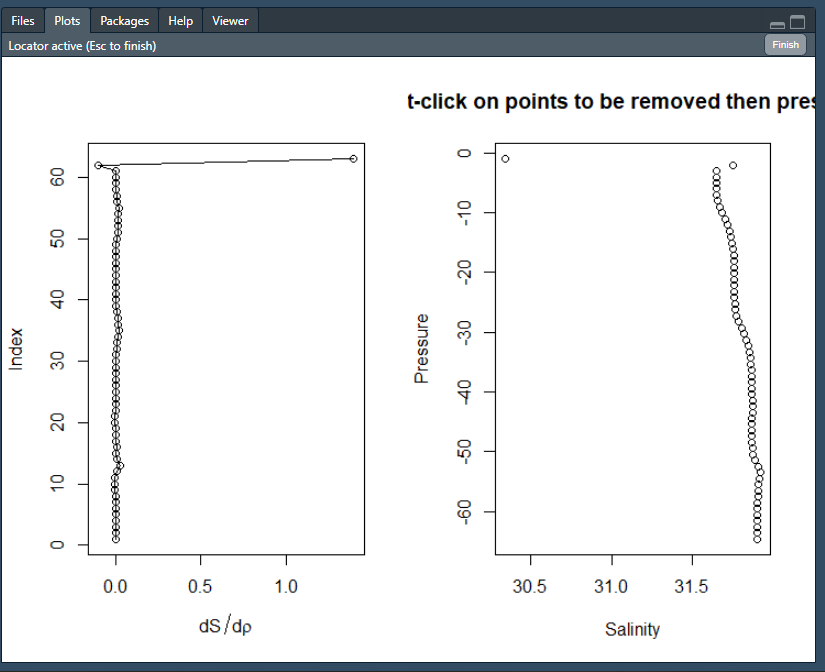
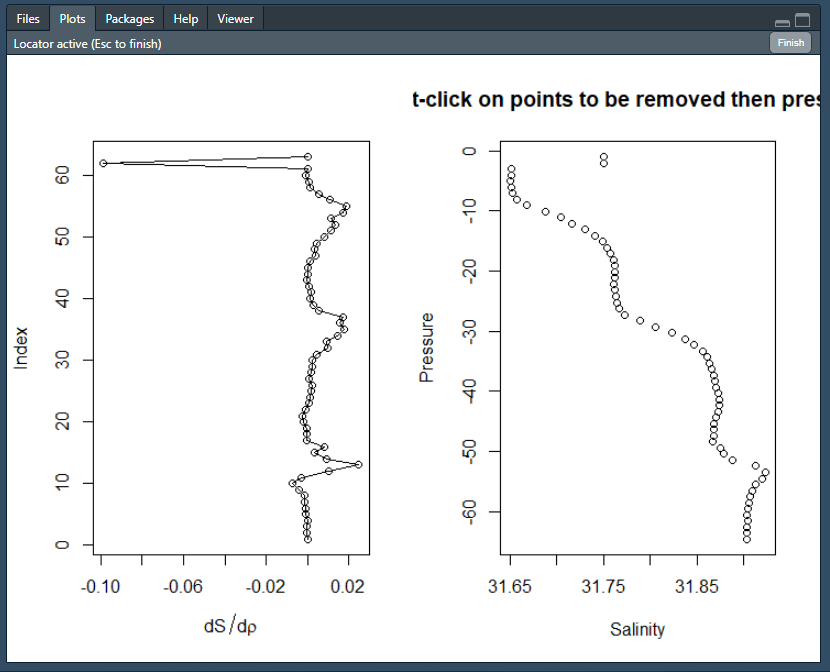
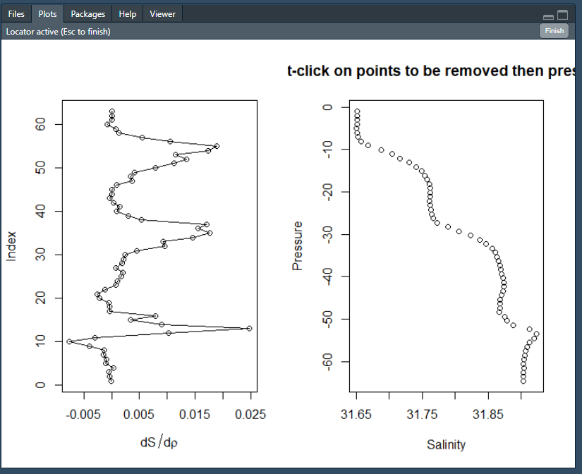
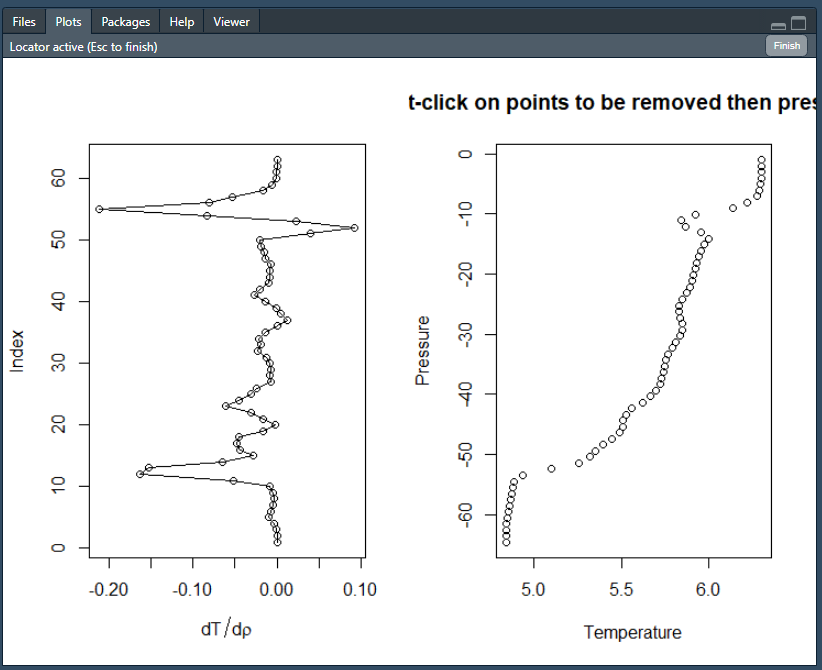
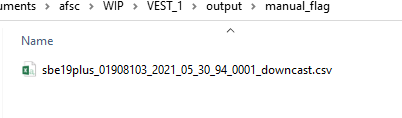
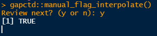

# Manual flagging and interpolation of erroneous data

The `manual_flag_interpolate` function allows users to select outliers that should be removed and interpolated using the base R graphical user interface (GUI). The function searches the `./output/density_corrected/` directory for profiles and users review plots of salinity, temperature, and oxygen (future) data one-by-one to remove erroneous data. Erroneous data for all variables from the depth bin are removed and interpolated. Once there are no further corrections to be made to a profile, the manually corrected profile is written to `./output/manual_flag`.

To start the function, run:

```{r manual_flag, include=TRUE, eval=FALSE}
gapctd::manual_flag_interpolate()
```

Running the function opens the R GUI with two plots. <br>

<br>
The plot on the left is the rate of change in the variable (T,S,O) with pressure and the plot on the right is the variable versus pressure.  <br>
To flag a point for removal, click on the point on the <b><u>right</u></b> panel.  <br>
Multiple points can be selected at a time.  <br>
After completing the selection, click the 'Finish' button in the top right of the pane or Esc on the keyboard. <br>
<br><br>
As is often the cast with downcasts in the example data set, the shallowest point is a clear out outlier so I removed it, which results in:

<br><br>
Removing the first point did not fix all of the issues, so now the shallowest two points are removed by clicking on each of them then clicking 'Finish'. The results is:

<br><br>
The resulting profiles looks a lot better, so click 'Finish' and move on to temperature, which has the same basic layout as the salinity profile.


<br><br>
The temperature profile has a slight bump at around 11 db, but looks fine overall so click 'Finish'. <br><br>

Data from the first profile is saved to `/output/manual_flag`:


<br><br>
 To move on to the next profile, type 'y' in the Console and press Enter. 
 
 <br><br>
 

## Frequently Asked Questions
<br>
<b>Question: How do I undo the flagging and interpolation from a profile?</b><br>
Answer: You can't undo flagging and interpolation on the profile using the GUI. However, by deleting the profile's csv from `/output/manual_flag/`, you can review and re-flag the original data the next time you run `manual_flag_interpolate`.<br><br>

<b>Question: Can I quit during the middle of flagging and pick up where I stopped later?</b><br>
Answer: Yes. In R Studio, navigate to Session -> Quit Session or press Ctrl+Q. The next time you run `manual_flag_interpolate`, it will start with the first cast for which there is no file in `/output/manual_flag/`.
